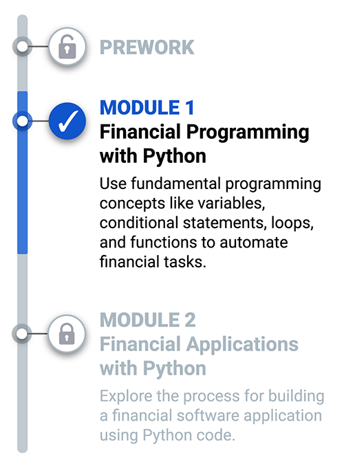
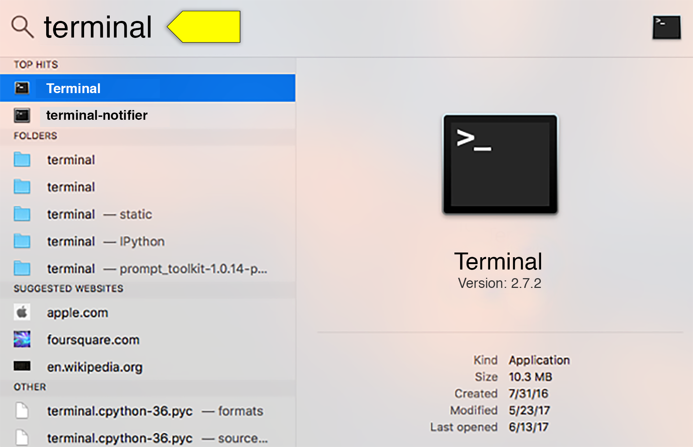
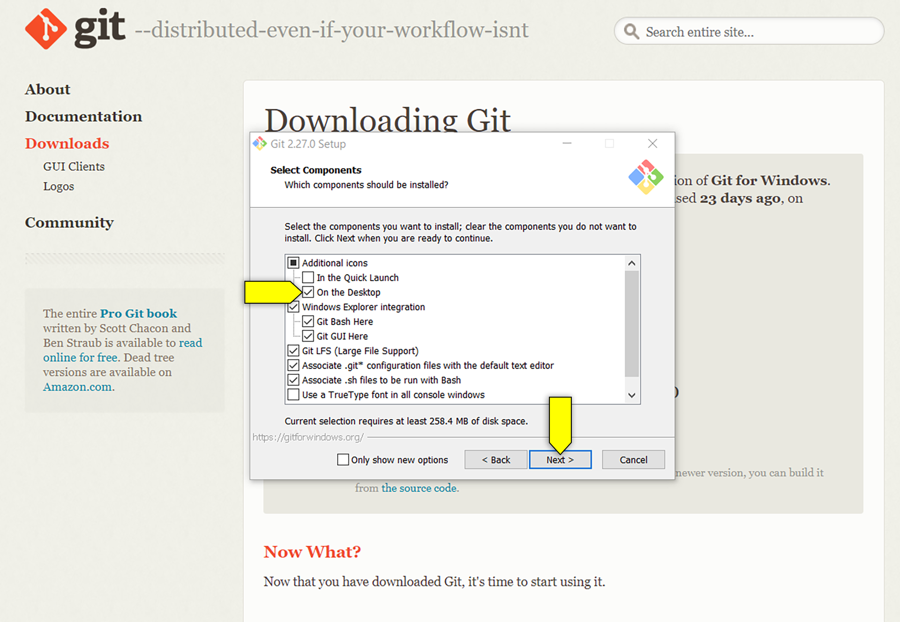
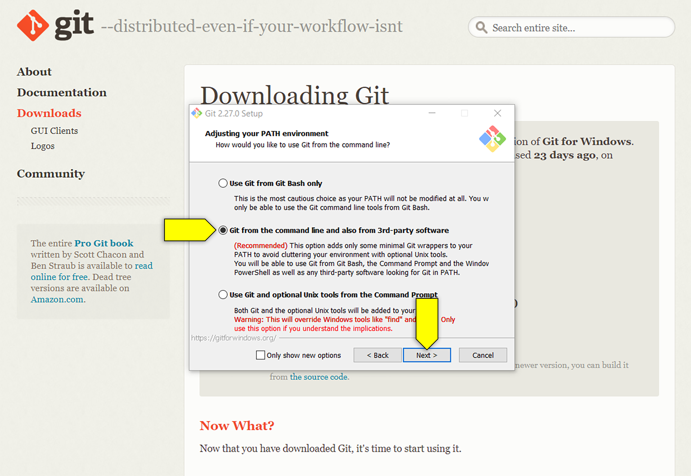
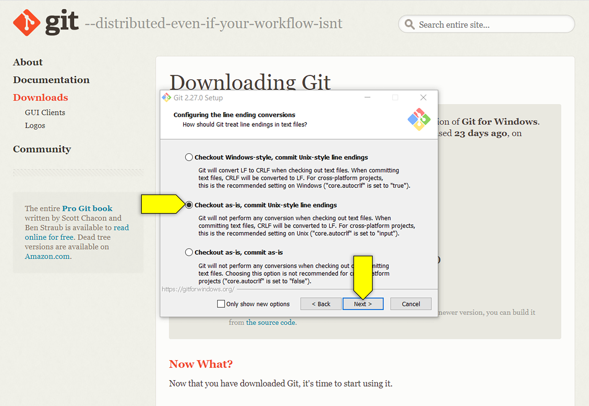
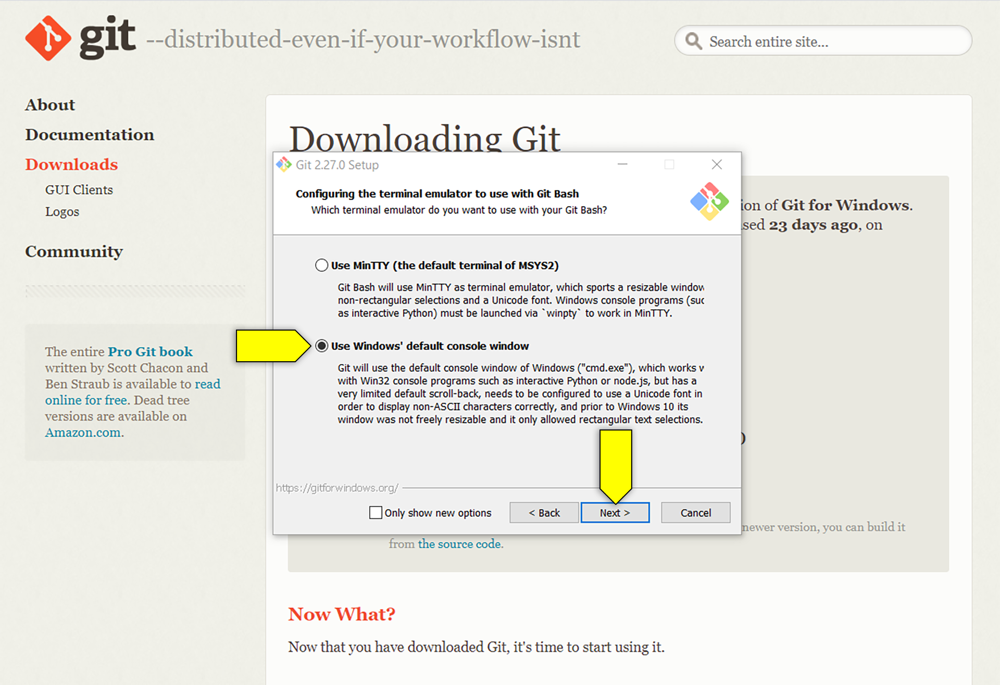
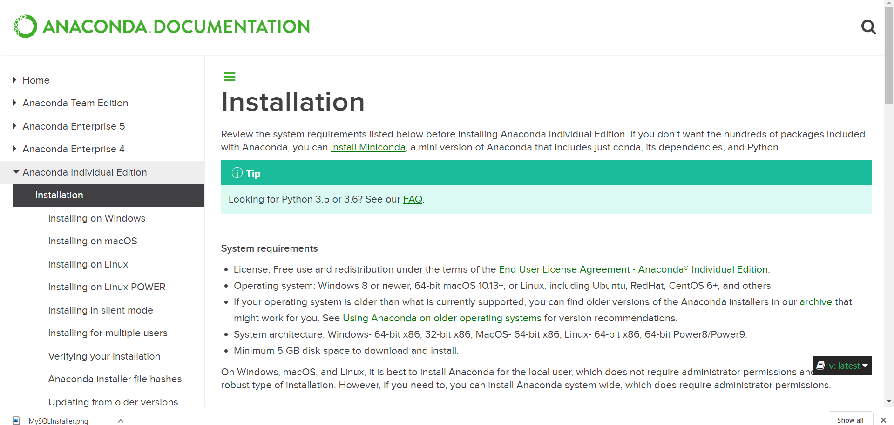
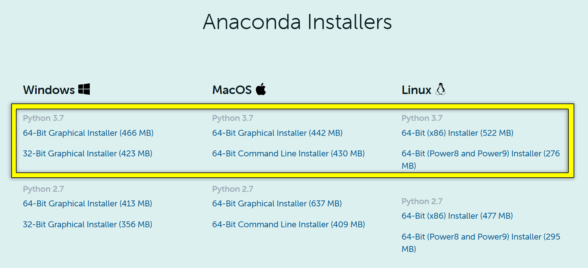
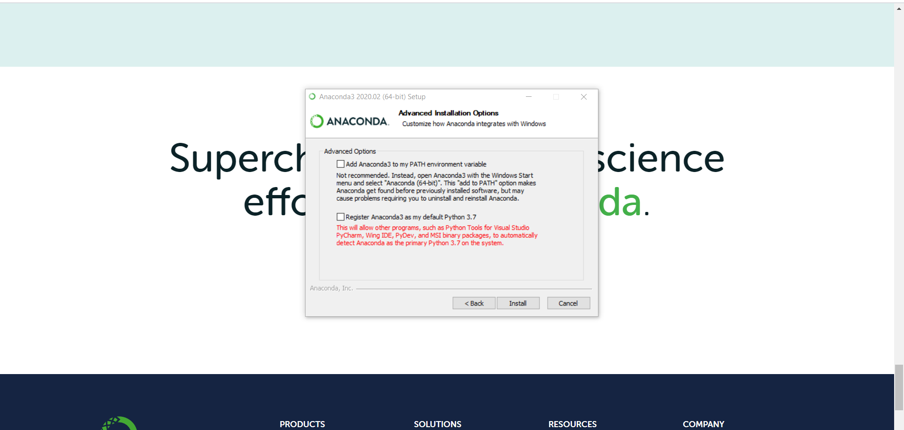
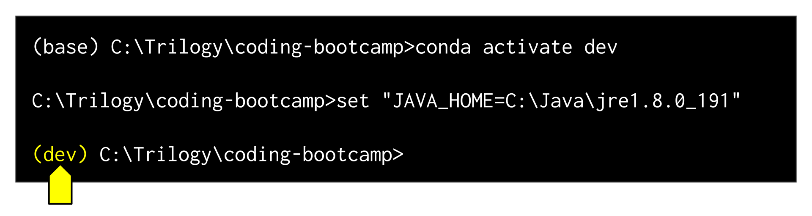

# Financial Programming with Python

## Introduction

Python is one of the most popular and in-demand programming languages in the fintech world. Python is readable as well as versatile, used for everything from analyzing large datasets to building web applications. In this module, within the Python framework, you’ll learn how to apply fundamental programming concepts to financial calculations. The following video will explain what else you can expect in this first module:

<iframe src="https://fast.wistia.net/embed/iframe/lyj9yr9wvq" title="1.0 Module Introduction Video" allow="autoplay; fullscreen" allowtransparency="true" frameborder="0" scrolling="no" class="wistia_embed" name="wistia_embed" allowfullscreen msallowfullscreen width="640" height="360"></iframe>

## Roadmap

Every module in this course will begin with a Roadmap page. Here you’ll get an overview of where you are in the course, what you’ll learn next, and how it all relates to fintech. You’ll also get a preview of the Challenge assignment that you’ll work toward as you complete the lesson material.

### Looking Ahead

**Fintech** is the use of technology to redefine traditional finance processes and procedures, some of which require time-consuming, repetitive tasks. By creating programs that perform routine tasks and calculations, you can automate—and therefore improve—many processes. In this module, you’ll explore fundamental programming concepts underlying these technologies, all within the structure of the Python coding language.

In this module's Challenge assignment, you’ll apply the building blocks of the Python language to analyze a microfinance loan portfolio. To succeed in this Challenge, you’ll need to do the following:

* Use Python code to examine the structure and characteristics of the microfinance loan portfolio.

* Develop functions that streamline and automate the loan portfolio analysis and financial calculation processes.

* Export the results of your analysis to an external file.

### Why This Matters

Fintech pioneers and entrepreneurs have realized that many traditional financial processes can be streamlined or automated with code. Automation leads to operational efficiencies, which helps organizations to save both time and money.

With its vast collection of libraries, the ability to handle large datasets, and strong visualization tools, Python has become one of the most popular languages underpinning the fintech wave.

In this module, you'll learn the building blocks of all code and how those building blocks are used to construct a codebase. The fundamentals learned in this module will form the foundation for this week’s Challenge assignment, upcoming material in this course, and your future fintech career.

### What You Will Learn

By the end of this module, you’ll be able to do the following:

* Explain how using Python creates operational efficiencies in the finance world. (Lesson 1.1)

* Write programs using Python code structures like variables, loops, conditional statements, and functions to evaluate complex financial scenarios. (Lesson 1.2)

* Evaluate Python data structures native to a codebase or imported from an external file. (Lesson 1.6)

* Import external files to your Python program as well as export results to an external file. (Lesson 1.6)

* Create a GitHub repository and upload a project folder. (Lesson 1.7)

### Planning Your Schedule

We’ve designed the module so that each lesson takes about one to two hours to complete. The actual time will depend on your own experience as well as the time you spend on the lesson activities. The content will prepare you for success in the weekly Challenge. As a heads-up, some students find that the following lessons take a bit more time:

* Financial Decisions

* Financial Automation

## Getting Started

Welcome to the Getting Started page. This is where you’ll spend some time each week setting up the tools and software that you’ll need to complete the lessons and challenge.

For Module 1, you'll need to install or set up the following:

* Git Bash (Windows) or Terminal (macOS)

* Python

* Anaconda/conda

* Visual Studio Code

Let's get started.

### Git Bash and Terminal

Git Bash (for Windows users) and Terminal (for macOS users) offer a **command-line interface**, or **CLI**, for working with the files and folders on your computer.

You can think of the command line like Finder or Windows Explorer, without the visuals—it's just a box with text.

> **Pro Tip** The term **command line** is often used interchangeably with the generic term **terminal** when referring to the command-line interface. Mac users access the command line via the Terminal application (capital T), while Windows users access the command line via Git Bash. So when you see the command line or the terminal mentioned, know that both terms refer to Terminal or Git Bash.

Why use the command line? Over time, you'll learn how the command line can be faster and more effective than your operating system's graphical user interface (GUI). You'll get plenty of exposure to the command line, or terminal, throughout the course.

#### Terminal (macOS)

If you're using macOS, you'll enter your command-line code using Terminal. This is built-in for Mac computers, so you don't need to install anything. To access Terminal, follow these steps:

1. Press the Command key and the spacebar to open Spotlight Search.

2. Type "terminal" into the search and then press Enter, as shown in the following image:

    

    A box should pop up—this means that you're in Terminal!

#### Git Bash (Windows Users)

Git Bash is a tool for helping us navigate computer files and folders. In this course, Windows users must use Git Bash, not the Windows terminal or PowerShell.

If you're on a Windows machine, follow these steps:

1. Go to the Git [Downloads page](https://git-scm.com/downloads). Select the download for Windows.

2. Select "On the Desktop." This will save Git Bash to your desktop. Once this executable file is downloaded, open it up in order to see the following setup dialog:

    

3. Select "Git from the command line and also from 3rd-party software" like in the following image, and then click Next.

    

4. Select “Checkout as-is, commit Unix-style line endings," like in the following image:

    

5. Select "Use Windows' default console window," like in the following image, and then click Next.

    

Great! Now let's move on to Python and Anaconda.

### Python, Anaconda, and conda

Anaconda is a free, open-source software environment that consists of Python and several related libraries like Pandas, NumPy, and SciPy. At a high level, Anaconda provides the tools you need to develop, test, run, and present your Python projects.

One of Anaconda's software packages is conda, which we'll set up later. Conda assists with the installation and configuration of Anaconda-related programs.

This section walks you through the Python, Anaconda, and conda installation process for both macOS and Windows users. It also provides general information about virtual environments and walks you through the steps to create one on your machine.

#### Install Anaconda with Python 3.7+

The following video shows how to install Anaconda for macOS. Step-by-step instructions are also provided.

##### Install Anaconda for macOS

<iframe src="https://fast.wistia.net/embed/iframe/f6gviqeehb" title="1.0 Anaconda Install (Mac) Video" allow="autoplay; fullscreen" allowtransparency="true" frameborder="0" scrolling="no" class="wistia_embed" name="wistia_embed" allowfullscreen msallowfullscreen width="640" height="360"></iframe>

##### Install Anaconda for Windows

The following video shows how to install Anaconda for Windows. Step-by-step instructions are also provided.

<iframe src="https://fast.wistia.net/embed/iframe/miw6ph367g" title="1.0 Anaconda Intall (Windows) Video" allow="autoplay; fullscreen" allowtransparency="true" frameborder="0" scrolling="no" class="wistia_embed" name="wistia_embed" allowfullscreen msallowfullscreen width="640" height="360"></iframe>

##### Written Instructions for Installing Anaconda

1. Navigate to Anaconda's [Installation page](https://docs.anaconda.com/anaconda/install/).

2. From the left-hand menu, under Anaconda Individual Edition, click the appropriate option for your operating system (either “Installing on Windows” or “Installing on macOS”).

3. Follow the steps on screen to complete the installation.

    

    > **Important** Use the Anaconda distribution that includes Python 3.7, as shown in the following image:
    >
    > 

4. When the download is complete, follow the installation instructions provided by the install wizard.

    > **Caution** Attention all Windows users! If prompted, do NOT check the box to set your PATH environment variable or to register Anaconda as your default for Python 3.7, as shown in the following image:
    >
    > 

#### Set Up Your Python Virtual Environment

You'll need to set up a virtual environment, also called a development environment.

Creating a virtual environment is a common practice for programmers. A **virtual environment** is an isolated, working copy of the coding environment that programmers use to install different versions of software packages for specific projects. Some projects may require the latest versions of software, and some may require older versions. In other words, a virtual environment is like a sandbox that contains the toys you want to play with for specific activities.

We'll create a virtual environment that includes the modules and packages we need for Python projects. Unlike a sandbox at a playground, you can leave this virtual sandbox anytime—and all the toys will still be there when you come back.

We'll use conda to set up the virtual environment. Conda is a package manager application that quickly installs, runs, and updates packages and their dependencies. It allows you to easily set up and switch between environments on your local computer. Conda is included in all versions of Anaconda.

> **Deep Dive** For more information, see [Python's tutorial on virtual environments and packages](https://docs.python.org/3/tutorial/venv.html). For help with installing conda, see the [Conda user guide](https://docs.conda.io/projects/conda/en/latest/user-guide/).

To install the conda virtual environment, follow these steps:

1. Open Terminal (macOS) or Git Bash (Windows).

2. **macOS users:** If you're running an OS version earlier than 10.15 OR running version 10.15 with a `bash` terminal environment, type `conda init bash`. If you're running versions 10.15 (Catalina) or later AND running the `zsh` environment, type `conda init zsh`.

    > **Hint** Check your OS version by clicking the apple icon in the upper left corner of your screen and select "About This Mac." To verify the shell you're using, type `echo $SHELL` in Terminal.

      **Windows users:** Type `conda init bash` in Git Bash.

3. Close and reopen Terminal (macOS) or Git Bash (Windows) for the change to take effect.

4. Type `conda --version` at the command prompt to check the `conda` version that is installed.

5. Update conda by running the update command `conda update conda`. If a newer version is available, accept the update by typing "y".

6. To create the `conda` virtual environment, type the following: `conda create -n dev python=3.7 anaconda`. When prompted, choose `y` to proceed. Something like the following image should appear in the terminal window:

    

> **Note** You’ll use the instructions `conda activate dev` and `conda deactivate` frequently when initiating and disabling the conda dev environments on your machine.

7. In the Git Bash terminal, type `conda init bash` to ready the terminal for conda environments. Close and reopen Git Bash, and then enter `conda activate dev` to activate the development environment. The command prompt should now reflect the new environment with the (dev) tag, like in the following image:

    

At this point, your installation of Anaconda and the conda package manager is complete.

### Install Visual Studio Code

Visual Studio Code, or VS Code, is an integrated development environment (IDE) you'll use to write and run your Python code in this module.

> **Important** Be careful not to confuse **virtual environment** and **integrated development environment**—these are two different things. An IDE is a tool that helps you write code. Virtual environments have more to do with where you run code and what code you have access to.

VS Code should have been downloaded as part of your prework for this course. If you haven’t installed it yet, follow the instructions for your operating system:

* [macOS](https://code.visualstudio.com/docs/setup/mac)

* [Windows](https://code.visualstudio.com/docs/setup/windows)

Congratulations! You've now finished all of the setup, and you are ready to start coding!

## Getting Ready for Virtual Class

In addition to the module lessons, this course includes two required virtual classes each week. In these classes, you'll have the opportunity to practice your new skills with your instructional team and ask any questions that you may have about that week's content. This "Getting Ready for Virtual Class" page is included at the beginning of each module and will help you prepare for those classes.

Be sure to download the starter files and have them ready on your machine prior to class. You don’t need to complete any of the activities before class, but feel free to review the material ahead of time to see some of what will be covered.

### Virtual Class I

To make the most out of class, aim to do the following before you meet:

* Complete the prework.

* Set up your GitHub account.

* Complete Lessons 1, 2 and 3.

Download the following activity files before class:

[Activities for the first Virtual Live Lesson](Live_Lessons_Activities/Class_1_Activities.zip)

### Virtual Class II

To make the most out of class, aim to do the following before you meet:

* Complete Lessons 4, 5, 6 and 7.

* Review the Challenge instructions.

Download the following activity files before class:

[Activities for the second Virtual Live Lesson](Live_Lessons_Activities/Class_2_Activities.zip)
