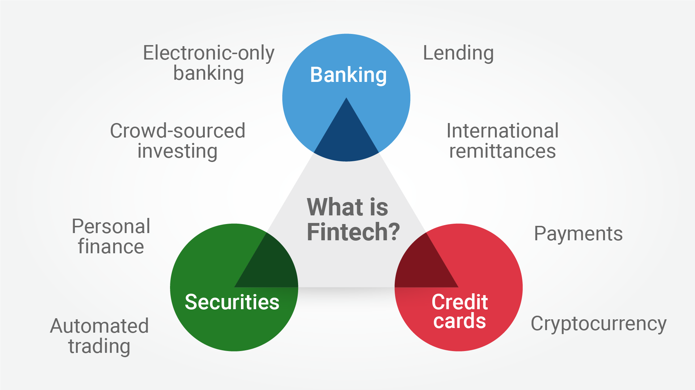
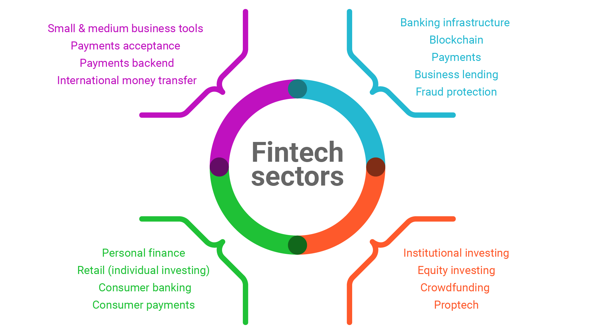

# Lesson 1: The Age of Fintech

## What Is Fintech?

When we talk about **fintech**, or financial technology, we’re referring to the technological innovation that aims to improve traditional financial methods and services. The following image illustrates the convergence of these financial services:

When fintech first emerged around the beginning of the 21st century, the term mainly referred to back-end systems of financial institutions. But, due to technological advances as well as shifts in consumer preferences, the meaning has evolved over time.

Today, the term describes a broader variety of financial activities, from mobile check deposits to crowdfunding campaigns. It also has a distinct consumer focus: by disrupting traditional finance, fintech aims to provide better, more efficient services for a wide consumer base.

> **On the Job** Fintech’s rapid growth in recent years has led to an explosive demand for technological investment—and more importantly, expertise. This need for more technologists in the industry has contributed to attractive career opportunities in terms of both growth and pay.

Job openings have surged especially for the following roles, and more:

* Financial analysts

* Risk analysts

* Quantitative traders

* Investment data analysts

* Software engineers

* Technology consultants

* Financial managers

* Research analysts

* Financial applications developers

## How Is Fintech Disrupting Finance?

Fintech is reshaping many financial sectors. The following graphic isn’t comprehensive, but it shows the far-reaching impact of fintech across industries:

As listed in the image, fintech sectors range from international money transfer to banking infrastructure, and from personal finance to crowdfunding—and that's only the beginning.

But how, exactly, has fintech disrupted these domains? The following themes have played key roles in the process:

* Automation

* Big data and cloud infrastructure

* Mobile infrastructure

* Blockchain

Let’s examine each of these concepts in more depth.

### Automation

One of the foundational concepts of fintech (and this course) is **automation**. Financial services and processes that were once done manually or face-to-face have become automated through technological innovation—thus boosting operational efficiency.

Automation in some form appears in pretty much every fintech industry disruption. Take floor trading, for example. In the old days, stock trading was done on the trading floor, with traders negotiating prices face-to-face. Though this in-person interaction still occurs—for instance, on the floor of the New York Stock Exchange—floor trading has largely been replaced with algorithms that can automatically buy or sell financial orders on the exchange.

Tools like Python, APIs, machine-learning algorithms, and more all deal with and enable automation in some way. This course will give you insight into and extensive practice with all of them.

### Big Data and Cloud Infrastructure

Rapid technological advancement has resulted in **big data**—large volumes of often complex data. Because businesses use this data to drive decision-making, they need to process it efficiently.

Traditionally, companies needed to invest large sums of money in server hardware to process data. Cloud computing, or **the cloud**, has changed this process. The term **cloud infrastructure** refers to on-demand computer services (servers, databases, and software) that are accessible via the internet.

Major companies like Amazon, Microsoft, and Google provide cloud computing that eliminates the need for businesses to purchase their own servers. Often, companies offer these cloud-computing services free of charge or on an as-needed basis. This way, small businesses and startups can better compete with established companies—without having to invest in their own servers.

Servers hosted in the cloud also reduce time-to-market by enabling companies to deploy applications more quickly.

### Mobile Infrastructure

Not all that long ago, very few people had ever used a cell phone. Flash forward to today, and we use cell phones not only for communication but also for banking, entertainment, navigation, and more.

Mobile infrastructure advancements have benefited businesses and consumers alike. On the one hand, mobile technology allows businesses to advertise their services and to brand themselves. Companies can target consumers as a resource pool of business data.

On the other hand, mobile technology has increased consumer expectations for quick and reliable channels of engagement. For example, consumers are more likely to trust companies that have efficient and well-designed mobile applications. Therefore, businesses must invest in mobile technology to meet consumer demands and stay competitive with their industry peers.

### Blockchain and Cryptocurrency

**Blockchain** is a disruptive technology that was created to increase trust between people and businesses by removing centralized control.

Historically, large-scale financial applications have been built in highly regulated environments. But the traditional finance system suffers from inefficiency—it can take a few days to finalize a bank transfer, for example, because banks have to settle with each other using outdated technology. Audits don’t always happen in a timely manner (or at all), so many things can slip through the cracks.

However, new systems have been developed to automatically enforce trust, auditability, and transparency through improved technology. Powered by blockchain, these systems can send values worth hundreds of millions of dollars across the globe within a few minutes—for just a few dollars in fees.

At a high level, blockchain creates a provable, historical record of each step of a transaction between producer and consumer. You’ll soon learn that even the largest established banks, like JPMorgan Chase, have started applying this technology.

Cryptocurrency, the original application of blockchain technology, provides a means for people around the world to transact with each other without interference. It has also been used as an escape from hyperinflation.

Although cryptocurrency is more volatile than traditional markets, its liquidity has increased over the years. What’s more, many decentralized finance protocols have emerged to create stable cryptocurrencies.

Today, fintech firms like Circle, Bitpay, and Figure have based their business models on blockchain technology.

> **On the Job** Blockchain technology offers plenty of career opportunities. Large companies like Amazon, Microsoft, and Fidelity are hiring blockchain engineers with increasing frequency. JPMorgan Chase—which develops Quorum, an Enterprise Ethereum blockchain—has also hired numerous blockchain engineers.

## The Fintech Professional’s Tool Kit

By this point, you should see that financial institutions are becoming technology institutions as well. For that reason, this course is designed to give you a strong foundation in the core technical skills you need to succeed in fintech. By the end of the program, your professional tool kit will include key technologies like the following:

### Programming and Financial Library Tools

* Python

* Pandas

* PyViz

* APIs

* Amazon Web Services (AWS)

* SQL

* NumPy

* SciPy

### Machine-Learning Tools

* Supervised and unsupervised learning

* Deep learning

* Natural language processing and conversational AI

* Cloud-based ML

* Algorithmic trading

* Robo-advisors

### Blockchain Tools

* Wallets

* Smart contracts

* Cryptocurrencies

The first of these tools that we’ll cover is Python, which we’ll use throughout the course. Python is quickly becoming one of the most popular programming languages, used by coders and financial analysts alike. In this module, you’ll learn the fundamentals of coding—variables, data structures, conditional logic, and more—in the Python ecosystem, to automate financial calculations and tasks. We’ll use Python a lot in this course, so consider this module the first milestone in what is sure to be an exciting and rewarding fintech journey!
