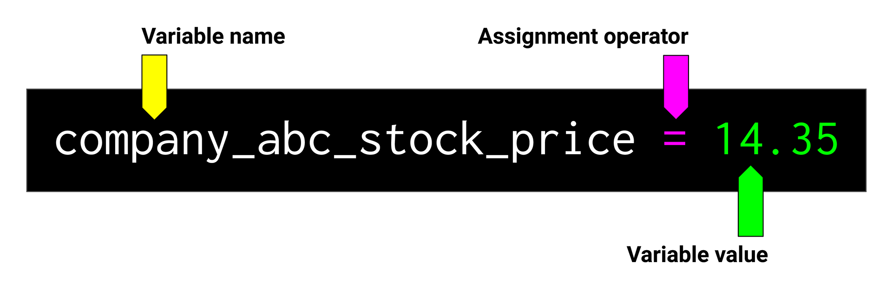
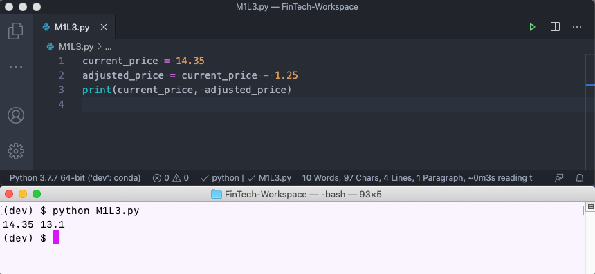
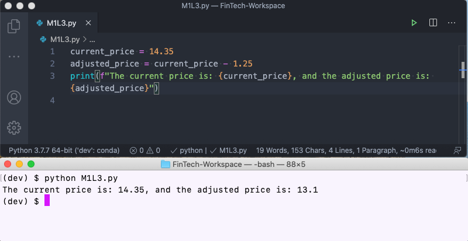
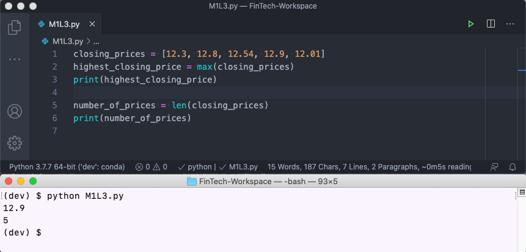
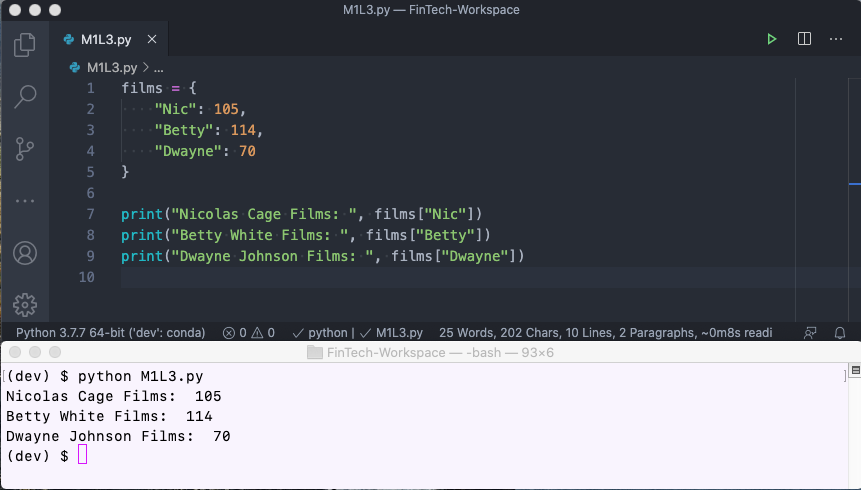
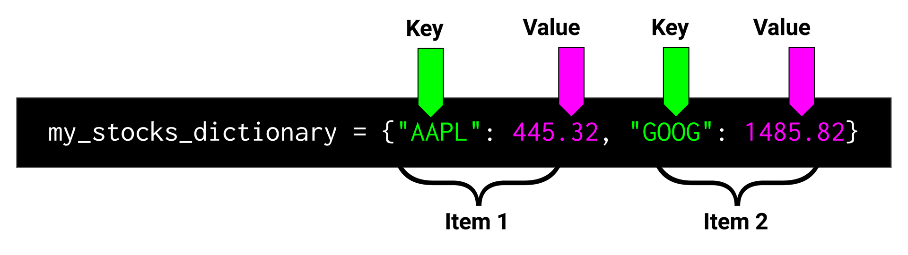
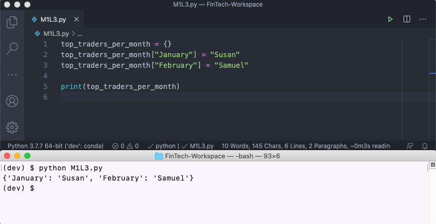
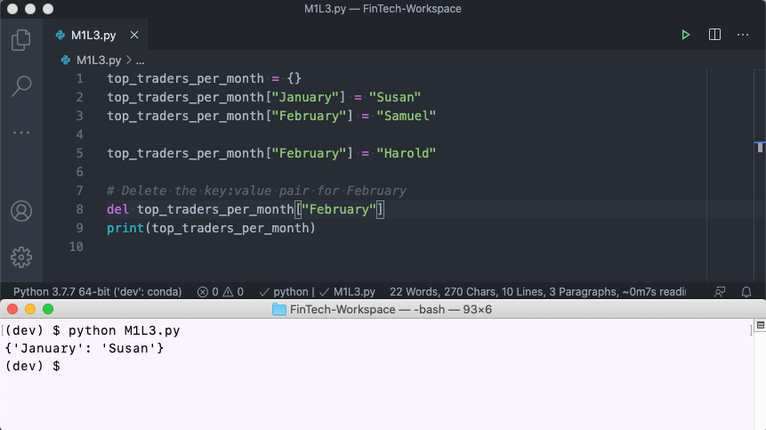

# Lesson 3: Financial Data

## Financial Data and Python

Finance involves all types of data, ranging from the small and simple to the large and complex. Take stock prices, for example. You may have data on just a few prices or on a few million. You may need to organize these stock prices across regions or by date. How you handle data in Python often depends on how simple or complex that data is.

### Using Python in the Fintech World

When it comes to finance, Python has become the standard programming language for the industry. For one, it's more user-friendly for writing code than some of the more technical languages, like C++. Additionally, writing in Python makes it easier to collaborate, update old systems, and build new ones—because so many programmers use Python, everyone can code in the same language.

A lot of coding just involves storing and interacting with data. The more data we have, the more sense it makes to automate these two steps.

Consider the stock prices example again. If you wrote code to predict the price of just one stock, you could instantly apply that code to do the same thing for a million more stocks. Your code would just have to store the stock prices you wanted to predict as well as store the function you wrote to make the prediction.

> **Challenge Connection** In this week's Challenge, you’ll write a program to determine values for a few different loans. But with just a little modification, this same program could be extended to automatically trade those loans or to determine values for millions of loans at a time—which highlights the efficiency of using code to perform financial tasks.

This kind of flexibility—to change a program to do whatever you want—exists in part because all programs involve the use of variables. In the first part of this lesson, we'll drill deeper into what variables are and how to use them to automate tasks.

## Variables

**Variables** are a fundamental building block of all programming languages. They serve two primary functions: they hold the data in your code, and they use names that make sense to humans.

> **Important** A variable is the primary means of data storage in any computer program. To a computer, a variable is a name that represents a stored value in its memory that can be accessed by the program at a future time.

### Variables in Finance

Let's think about variables using the example of a company's stock price. The name of the company is defined as `company_abc_stock_price`, and the value is the stock price of `14.35`.

In Python code, the expression that defines the name and the value would appear as follows:

```python
company_abc_stock_price = 14.35
```

Whenever we want to use that data (`14.35`) later in the program, we can just refer to the variable name. You can use `print` any time you want to display text in the terminal. So in the following code, we tell the computer to display the value of `company_abc_stock_price` using the print statement:

```python
print(company_abc_stock_price)
```

Running these statements in VS Code results in the following:


Now try doing this on your own in the following Skill Drill. Skill Drills are ungraded, quick prompts designed to give you practice in a skill you just learned. If you find yourself stuck after several minutes, move on—but be sure to ask for support from your instructional staff.

> **Skill Drill** Create a variable on your own. Open a new Python file and input your code.

Let's take a closer look at how to create and use variables.

### Create a Variable

To create a variable in Python, you give it a name. Giving a name to a variable is known as **declaring** it. This name is how you’ll refer to the variable throughout the remainder of the Python program. In the previous example, we declared a variable by typing `company_abc_stock_price`.

You can create as many variables in a Python program as you require, and they can be created at any point in the program.

#### Naming Variables

You should always assign descriptive names to variables, so that you and any other programmers will know what the variable name represents. Well-named variables significantly increase the readability of Python code.

For example, instead of naming variables `score_a` and `score_b`, we could use the more descriptive names `home_team_score` and `away_team_score`. And in place of a vague name like `portfolio`, we should name the variable something like `microfinance_loan_portfolio`.

> **Important** Variables in Python are declared in **snake_case**. This means that, for multi-word variable names, each word is separated by one underscore (_) character and no spaces, and each element's initial letter is lowercase—like in the example of `company_abc_stock_price`.

Great! You've declared a variable, but now what? The next step is to assign it some data.

### Assign Data to the Variable

Once you have a descriptive name for your variable, you can assign data to that variable.

We’ll use an **assignment operator** to set the variable equal to a value, as shown in the following image:



For example, look at the code from earlier:

```python
company_abc_stock_price = 14.35
```

Here, we've assigned the value `14.35` to the variable `company_abc_stock_price`.

A cool thing about variables is that you can assign almost anything to them—even other variables! See the following example:

```python
current_price = 14.35
company_abc_stock_price = current_price
```

Here, we have a variable named `current_price`, which equals `14.35`. On the next line, we created a new variable called `company_abc_stock_price` and set that equal to `current_price`. Thus, `company_abc_stock_price` will have the same value, `14.35`.

#### Using Variables to Hold Calculation Results

Variables can also hold the results from a calculation. Financial programmers do this all the time.

For example, suppose that we wanted to subtract from the `current_price` of the stock the transaction cost if we decided to buy it—let's say $1.25 per trade, as follows:

```python
adjusted_price = current_price - 1.25
```

To confirm, we'll use the print statement to display both of these variables: one displaying the stock price and one after accounting for the $1.25 transaction fee, like in the following example:

```python
print(current_price, adjusted_price)
```

The result from running this code is as follows:



### Formatting Variables as Strings

Now that you know how to save calculations as variables, let's focus on how to print and format the results.

As we saw illustrated in the image above, if we run the following code, the Python program will print the numbers that are stored in the variables:

```python
current_price = 14.35
adjusted_price = current_price - 1.25
print(current_price, adjusted_price)
```

The result from running this code appears below:


To help format and explain the output, we can add text to the variables using **format string literals**, or **f-strings**. In Python, f-strings let us embed variable values in the text that we want to print.

For example, here's how we’d use f-strings to add formatting to the price output. Try to run the following code on your own:

```python
current_price = 14.35
adjusted_price = current_price - 1.25
print(f"The current price is: {current_price}, and the adjusted price is: {adjusted_price}")
```

The following updated output now clearly explains the values:



Now let's break down what's happening in the code snippet.

First, we create an f-string by starting the text string with the character `f`. This tells Python that the following text may have variables embedded inside.

Next, notice that the variables are enclosed in curly braces, or brackets: `{current_price}`. This special syntax tells Python to insert whatever is inside the curly braces directly into the text.

In this case, Python finds the value stored in the `current_price` variable and inserts it directly into the text string.

> **Deep Dive** You’ll use f-strings often in this course. To learn more, read the [Python Enhancement Proposal for Literal String Interpolation](https://www.python.org/dev/peps/pep-0498/).

Now that you know the basics of variables, time for some hands-on practice with them.

## Activity: Hello Variable World

Throughout this course, you'll complete multi-step, ungraded activities designed to apply your skills to a fintech problem. Most activities require files that you’ll be prompted to download before starting. These required files may include starter code, which is partial code or comments to help you get started. Following the activity, you'll be provided with the solution so that you can check your work.

> **Important** When you download the files for an activity, you'll see a Solved folder and an Unsolved folder. Complete all of your work for the activity using the files in the Unsolved folder.

In this activity, you'll create a Python program that automates calculations for percent increase and decrease.

Start small by identifying the percent increase in price for Apple stock. Yesterday at 9:00 a.m., Apple's stock price was $198.87. At the close of the market today, the stock price was $254.32. Calculate the percent increase using the following formulas:

* `Increase = Current Price - Original Price`

* `Percent Increase = Increase / Original x 100`

### Files

Download the files for this activity to help you get started:

[Hello Variable World Files](Activities/01_Hello_Variable_World.zip)

### Instructions

Open `hello_variable_world.py` in the Unsolved folder. Then complete the following steps:

1. Create a variable named `original_price` and assign it the value `198.87`.

2. Create a variable named `current_price` and assign it the value `254.32`.

3. Create a variable named `increase` and assign the difference between the current price and the original price.

    > **Hint** Remember, you can create calculations and assign the results of that calculation to a variable. In this case, `new_variable = variable_a - variable_b`.

4. Divide `increase` by `original_price`, and then multiply by 100. Then assign the result to the variable named `percent_increase`.

5. Print all of the new variables.

### Solution

How did you do? Check your solution with the following assessment:

<p><iframe style="width: 100%; height: 800px;" src="/courses/244/external_tools/retrieve?display=borderless&amp;url=https%3A%2F%2Flearnosityplayer.atomicjoltapps.com%2Flti_launches%2FuZr4aKSDhCZ19p32wRToz9op" width="100%" height="800px" allowfullscreen="allowfullscreen" webkitallowfullscreen="webkitallowfullscreen" mozallowfullscreen="mozallowfullscreen" allow="autoplay *"></iframe></p>

If you want to review the solution step by step, use the following video walkthrough:

<p><iframe src="https://fast.wistia.net/embed/iframe/veu4fgtybk?seo=false" title="1.1 Activity 1: Hello Variable World Video" allow="autoplay; fullscreen" allowtransparency="true" frameborder="0" scrolling="no" class="wistia_embed" name="wistia_embed" allowfullscreen msallowfullscreen width="640" height="360"></iframe></p>

### What's Next?

Declaring variables in Python can be as simple as assigning a value, but remember, variables can also hold the results of a calculation. Either way, you should always use descriptive variable names so that you know what kind of data is being held.

> **Challenge Connection** You’ll use variables to store data in the Challenge, like the total amount of all loans in the portfolio and the amount of cash flows generated by the portfolio in a certain month.

But what happens if we have a large collection of data—thousands of data values? This is where data containers come in, which we'll learn about next.

## Data Containers

Variables are a useful and fundamental construct of programming languages. They let you use descriptive names for your data and reuse them throughout the program.

However, what happens when you have hundreds or thousands of data values? For example, what if you needed to store every company stock price in the S&P 500? That would be a heck of a lot of variable names!

The good news is that Python provides some special data containers to more easily manage the organization and collection of related data. You'll learn a lot about data containers throughout the course, but for now, you can focus on two fundamental data containers: lists and dictionaries.

## Using Lists

Pretend that you’re chatting with your friends, and they ask you to name your top three favorite movie stars of all time. Obviously, you name Nicolas Cage, Betty White, and Dwayne The Rock Johnson.

In Python, we can store this sequence of data in a container called a list. A **list** is a collection of ordered and changeable items. Lists are defined as a **data structure,** a construct that holds a group or collection of related data elements together. We can also write a program that prints this list.

> **Deep Dive** To learn more, visit the [W3Schools page on Python lists](https://www.w3schools.com/python/python_lists.asp).

Here's an example of the movie stars list in Python:

```python
best_movie_stars = ["Nicolas Cage", "Betty White", "Dwayne The Rock Johnson"]
print(best_movie_stars)
```

Running the code results in the following output:

![The two lines of Python code detailing the best_movie_stars and the print statement. The terminal shows the the output: ["Nicolas Cage", "Betty White", "Dwayne The Rock Johnson"] ](Images/using_lists.png)

In this example, the data is stored. But what happens if we need to retrieve a specific item in a list?

### List Indexing

Let's say that someone asks for the all-time best movie star from the list. Because lists store the items in order, we can get this value by specifying the **index**, or position, of the item in the list.

> **Important** List index positions start at 0, so the item at index position 1 is actually the second item in the list. The first item, `"Nicolas Cage"`, is at index 0.

See the following example:

```python
number_one_star = best_movie_stars[0]
print(number_one_star)
```

The result from printing the variable `number_one_star` is as follows:


> **Skill Drill** Which actor's name did the preceding example print out? Try running the code to see which one is at index position 1.

What if we need to find the second-best movie star of all time? We would index the second position in the list of movie stars, as follows:

```python
print(best_movie_stars[1])
```

The output from printing the second-best movie star of all time is:

![The two lines of Python code detailing the list best_movie_stars and the print statement calling best_movie_stars[1]. The terminal shows the the output: Betty White.](Images/list_indexing2.png)

#### List Slices

What if you only needed a subset or slice of a list? Python has thought of that too. You can select a range of values if you provide the starting position (start) and ending position (stop). Python will then return every value from the start index up to the stop index. Note that the stop isn’t inclusive! Here's an example of this:

![List of list indexing syntax includes “my_list[start:stop]” and other variations.](Images/1.3-list-indexing-diagram.png)

In this image, we see list indexing syntax for the following scenarios:

* Select items from the start index to the stop index.

* Select items from the start index to the end of the list.

* Select items up to the stop index.

* Select all items in the list.

Now let's apply this syntax to our list of movie stars. The following code will print the first and second items in the list.

```python
print(best_movie_stars[0:2])
```

The output resulting from this slice is detailed below:

![The two lines of Python code detailing the list best_movie_stars and the print statement calling best_movie_stars[0:2]. The terminal shows the the output: ['Nicolas Cage, 'Betty White']](Images/list_slicing.png)

In this example, the left number, `0`, is the starting index position. The number after the colon, `2`, is the stop index. You can read this as, "Give me the items in the list starting at index 0 and up to index position 2."

Note that the preceding stop value isn’t inclusive, so the item at index position 2 is excluded.

> **Deep Dive** For more information, refer to the [Python documentation on lists](https://docs.python.org/3/tutorial/introduction.html?highlight=list#lists).

### Add Items to a List

So far, we’ve been creating lists with a predetermined number of items. However, Python also lets us add new items to a list.

Consider the following empty list, which is currently just a set of square brackets with nothing inside:

```python
# Empty List
tech_stocks = []
```

Let's say that we want to add three of the major tech stocks to this list. To do that, we can use `append()`, a built-in method that can be used for lists, as follows:

```python
tech_stocks.append("AAPL")
tech_stocks.append("GOOG")
tech_stocks.append("AMZN")
print(tech_stocks)
```

The result is detailed below:

![The lines of code to create the tech_stocks empty list and those needed to append the tickers "AAPL", "GOOG" and "AMZN", and the prints statment calling 'tech_stocks'. The terminal shows the the output: ['AAPL', 'GOOG, 'AMZN']](Images/list_append.png)

Nice work so far! Now look at a couple more list operations.

### List Operations

Lists come with some handy tools that we can use on the data.

Suppose that we have a list of five days of closing stock prices for a company, and we want to know the highest stock price in that list. With Python, we can use a function called `max()` to tell us the highest value in the list.

The following example shows what the `max()` function looks like in action:

```python
closing_prices = [12.3, 12.8, 12.54, 12.9, 12.01]
highest_closing_price = max(closing_prices)
```

Now, let's say that you're given a huge list of closing prices and you need to determine how many prices are in the list. For this task, use the Python function `len()` to find the length of the list. Your code would look like the following example:

```python
number_of_prices = len(closing_prices)
print(number_of_prices)
```

The output appears as follows:



Now that we’ve covered the basics of lists, let's work with lists containing financial data.

## Activity: Listing Assets

In this activity, you'll play the role of a data analyst at a bank who needs to quickly find some information for a list of loans.

Use what you’ve just learned about lists to return the total number and maximum size of the loans.

### Files

Download the files for this activity to help you get started:

[Listing Assets Files](Activities/02_Listing_Assets.zip)

### Instructions

Open `listing_assets.py` in the Unsolved folder, and then complete the following steps:

1.  Note that the code begins with the following list:

    ```python
    bank_loans = [200, 500, 900, 100, 400, 800, 100]
    ```

2. Create a variable named `number_of_loans`. Declare its value as the length of the list of `bank_loans`.

3. Create a variable named `largest_loan_amount`. Set it equal to the maximum value from the list of `bank_loans`.

4. Print the largest loan amount.

### Solution

How did you do? Check your solution with the following assessment:

<p><iframe style="width: 100%; height: 800px;" src="/courses/244/external_tools/retrieve?display=borderless&amp;url=https%3A%2F%2Flearnosityplayer.atomicjoltapps.com%2Flti_launches%2FU7cnbviJEWy3KL5finp3tY4D" width="100%" height="800px" allowfullscreen="allowfullscreen" webkitallowfullscreen="webkitallowfullscreen" mozallowfullscreen="mozallowfullscreen" allow="autoplay *"></iframe></p>

If you want to review the solution step by step, use the following video walkthrough:

<p><iframe src="https://fast.wistia.net/embed/iframe/k6mmcwhial?seo=false" title="1.1 Activity 2: Soln Listing Assets Walkthrough Video" allow="autoplay; fullscreen" allowtransparency="true" frameborder="0" scrolling="no" class="wistia_embed" name="wistia_embed" allowfullscreen msallowfullscreen width="640" height="360"></iframe></p>

### What's Next?

The list in this activity contains only a small number of loans, so it’s possible to complete these steps manually. But when you have a lot more data, list functions are invaluable. Imagine trying to do calculations on a list of more than 1,000 loans!

By the way, how do you think you might add some sort of identifying number to each loan, like the borrower's name? In the next section, you'll learn about a data structure in Python that can hold this type of data depth: dictionaries.

> **Challenge Connection** In the Challenge, you'll use lists for all sorts of tasks, like calculating the average price in a list of prices and storing rows of a spreadsheet.

## Using Dictionaries

Lists are useful for storing and accessing items when order is important. However, we can also access data by a name or key.

In Python, a **dictionary** is a data container for pairs of labels (or keys) and values. See the following example:

```python
films = {
    "Nic": 105,
    "Betty": 114,
    "Dwayne": 70
}

print("Nicolas Cage Films: ", films["Nic"])
print("Betty White Films: ", films["Betty"])
print("Dwayne Johnson Films: ", films["Dwayne"])
```

In this example, the **key** is the name of the movie star, and the **value** is the number of films they’ve appeared in.

The output appears as follows:



### Key-Value Pairs

Elements in a dictionary are stored in **key-value pairs**. Here's a quick breakdown of dictionary syntax:

* Keys and values are separated by colons.

* The key-value pairs are separated by commas.

* Keys are generally coded as strings or numbers (usually integers). The values can be any data type, including lists or even other dictionaries!

In writing, a key-value pair of a dictionary looks like the following image:



Here, `my_stocks_dictionary` has the following key-value pairs:

* AAPL (key) and 445.32 (value)
* GOOG (key) and 1485.82 (value)

There are some critical differences between a list and a dictionary. But the most significant difference is that lists have an order in which values can be retrieved by their index position (`best_movie_stars[0]`), while dictionaries are stored in random order and are retrieved by their key or label (`films["Nic"]`).

> **Important** To access an item of a list, we use the value of its index position. However, to access the value of an item in a dictionary, we use its key. Dictionaries are based on the relationship between a key and its value. Think of a Python dictionary like a physical dictionary: if you know the word (key), you can find the definition (value).

Next, let's populate a dictionary with some items.

### Create Dictionary Items

With Python dictionaries, adding new items is a straightforward process: simply provide a key-value pair for the item you want to add. Consider the following empty dictionary with curly braces:

```python
top_traders_per_month = {}
```

We can add a new trader to the dictionary by providing a unique key (label) and the value. In this dictionary, the month of trading represents the key, and the top trader for that month is the value. Now it looks as follows:

```python
top_traders_per_month["January"] = "Susan"
top_traders_per_month["February"] = "Samuel"

print(top_traders_per_month)
```

The result appears below:



Updating a dictionary is also a straightforward process: provide the existing key and a new value. If the key exists, it will just update the value for that key. Here's an example:

```python
top_traders_per_month["February"] = "Harold"
print(top_traders_per_month)
```

In this code, we’re replacing the value for one of the keys: `"Harold"` is now the top trader for the month of February, replacing `"Samuel"` in the top spot. In other words, `"Samuel"` gets overwritten. Sorry, Sam!

The resulting change is prints as follows:


> **Skill Drill** Try coding the `top_traders_per_month` example and modifying one of the keys. Print the dictionary before and after the update to see how it changes.

### Delete Dictionary Items

You can also delete an item from a dictionary if you know the key. For example, here's how you’d delete an item from the `top_traders_per_month` dictionary:

```python
# Delete the key:value pair for February
del top_traders_per_month["February"]
print(top_traders_per_month)
```

The following output appears:



Great! For the next activity, try putting this all together to solve a financial problem.

> **Pro Tip** Did you notice anything different about the preceding code snippet? Look at the first line, which begins with a hash sign (`#`). This line, known as a **comment**, describes what the code is about to do. Comments aren't lines of actual code—the hash sign tells Python to skip this line. Rather, you can use them to keep track of what the code is doing, which is especially useful when you're collaborating with others or writing a program with a lot of code.

## Activity: The 401(k) Shuffle

In this activity, you’ll use both dictionary and list syntax to update a collection of 401(k) (retirement account) balances.

### Background

After a decade of working at various startups, you’ve amassed a collection of various 401(k) accounts. Enough is enough! It’s finally time to combine them.

First, you need to make sense of them. Fortunately, you can use what you’ve just learned about lists and dictionaries to do that.

### Files

Download the files for this activity to help you get started:

[The 401k Shuffle Files](Activities/03_The_401k_Shuffle.zip)

### Instructions

Open `the_401k_shuffle.py` in the Unsolved folder, and then complete the following steps:

1. Note that the Python file begins with the following dictionary:

    ```python
    accounts = {
        "Schwab": 2000,
        "Fidelity": 8000,
        "Merill": 3000,
        "Wells Fargo": 0.01
    }
    ```

2. Using dictionary syntax, print the amount of the Fidelity 401(k).

3. Delete the Wells Fargo account with one penny in it. (What's up with that? Is it a fake account?)

4. You've scored a new job—congratulations! But this means that you have another 401(k) account to add. Add the new account to your list of existing accounts. Because this one is with SoFi, make sure that your key in this new dictionary item is `SoFi`, and use `2000` for the amount.

5. All of your money is now invested in a single account through financial advisor WealthFront. Create a new dictionary to store this updated account information. Copy the following list, which contains all of your existing account balances, to your Python file:

    ```python
    old_account_amounts = [2000, 8000, 3000, 2000]
    ```

6. Sum your money from the `old_account_amounts` list, using the `sum()` list function. Save this total amount to a new variable named `total_amount`.

    > **Hint** `sum()` is another function available for lists in Python. It can be applied to any list with numbers in it to sum up each of the numbers in that list. You can use `sum()` just like you did with`max()` before to find the maximum number from a list. The syntax or code for this function is `sum([1, 2, 3])` . You can also use a variable name that contains a list of numbers, for example, `sum(numbers)`.

7. Create a new dictionary named `new_accounts`. Store a new key named `Wealthfront` (the new 401(k) manager) as the key, and the `total_amount` variable as its value.

### Solution

How did you do? Check your solution with the following assessment:

<p><iframe style="width: 100%; height: 800px;" src="/courses/244/external_tools/retrieve?display=borderless&amp;url=https%3A%2F%2Flearnosityplayer.atomicjoltapps.com%2Flti_launches%2FwnZKFdAymB9XLEVcGvrDAkqW" width="100%" height="800px" allowfullscreen="allowfullscreen" webkitallowfullscreen="webkitallowfullscreen" mozallowfullscreen="mozallowfullscreen" allow="autoplay *"></iframe></p>

If you want to review the solution step by step, use the following video walkthrough:

<p><iframe src="https://fast.wistia.net/embed/iframe/vzojaggttk?seo=false" title="1.1 Activity 3: Use Case 401k Shuffle Walkthrough Video" allow="autoplay; fullscreen" allowtransparency="true" frameborder="0" scrolling="no" class="wistia_embed" name="wistia_embed" allowfullscreen msallowfullscreen width="640" height="360"></iframe></p>

### What's Next?

Using only Python, you've now learned how to save data to dictionaries and lists. You can also perform useful calculations and save the results to variables.

Writing Python code comes down to managing variables, performing calculations, and storing and reading data—so you're off to an amazing start! Keep up the great work.

> **Challenge Connection** In the Challenge, you'll retrieve loan information from a dictionary to calculate present value and determine the fair value of a loan. Sounds like your newfound dictionary skills will come in handy!

Next, we'll take what we learned here a step further to automate financial decision-making—using Python!
