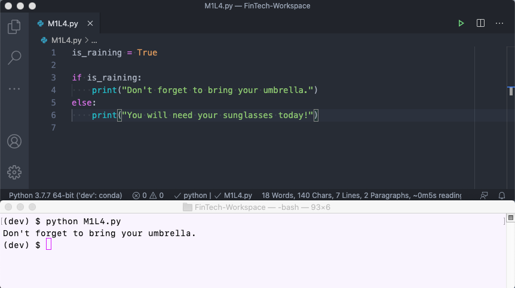
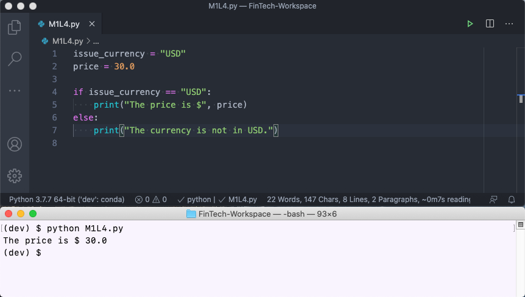
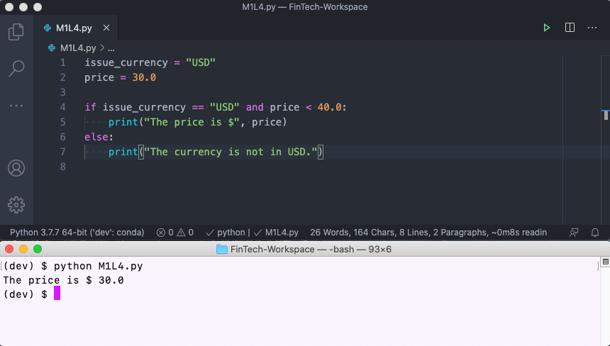
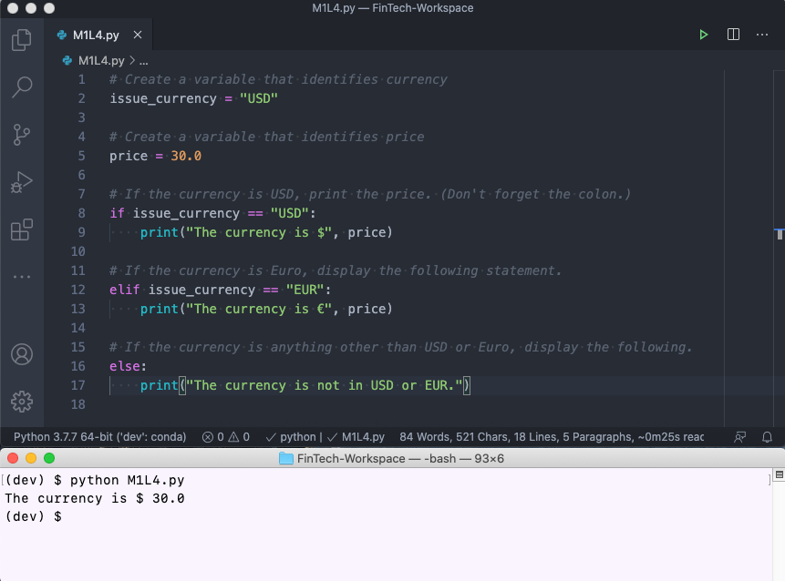

# Lesson 4: Financial Decisions

## Financial Decisions and Python

In finance, decisions often need to be made quickly, without human intervention.

Do you remember the last time you applied for a credit card online? Behind the browser, your information was channeled through an algorithm and then compared to historical data on millions of past borrowers to determine the probability that you’d make on-time payments.

Or consider high-frequency trading, another example of fast decision-making. A single algorithm is run on a server and buys and sells millions of securities in the time that it takes you to read this sentence.

Both of these examples feature amazing applications. But at their core, they do something very simple: they answer yes-or-no questions. One gives you a credit card or not; the other buys or sells.

### Using Conditionals to Make Decisions

Decision-making in code is done through **conditionals.** A conditional is really just a yes-or-no question, but written in computer syntax.

> **Challenge Connection** Conditional statements allow developers like you to make decisions or perform actions based on certain criteria. In the Challenge this week, you'll use conditional statements to write a program that automatically decides whether to purchase a loan, depending on its price.

In this lesson, you'll learn how to use conditionals in Python to make financial decisions.

## Conditional Logic in Python

Computers are simple: they do exactly what we tell them to do—meaning, we can tell computers to do all of the tedious work that we don't want to do.

Already we've seen how powerful this capability can be: previously, we told the computer to do a calculation and then store the results as a variable or data container that could be reused. By doing that, we're outsourcing tedious work to the computer, which frees us up to think about larger problems. Plus, the computer performs these tasks faster and more efficiently than we could.

Now we'll take automation a step further and automate financial decisions. Programming languages offer a way to automate decision-making through something called conditional logic. **Conditional logic**, a fundamental building block of all computer programs, is simply a way to control which code does or does not get executed. In other words, conditional logic refers to decision-making code.

> **Important** Conditional logic controls the flow of a computer program—that is, it determines the path a program will take depending on how the decision evaluates.

### Conditionals in Finance

To see how conditionals might be applied in a financial context, consider the following example:

```python
if stock_price < estimated_value:
    print("Buy this stock because it is on sale!")
else:
    print("Don't buy this stock because it is too expensive right now")
```

In the preceding code, we’ve created a conditional situation where the statement `if stock_price < estimated_value` is either `True` or `False`, with the following results:

* If the statement is `True`, the first message is printed.

* If the statement is `False`, only the second message is printed.

This conditional logic allows the program to decide to do something or not.

> **Skill Drill** In a new Python file, code the preceding example and run it with different values for `stock_price` and `estimated_value`, to see how the behavior changes.

## Truth Testing in Python

Because conditional logic is so fundamental to computer programming, Python includes data types that are specifically designed to hold the `True` or `False` value.

### Booleans

In Python, any variable that is assigned a `True` or `False` value (or is resolved to one of those values) is considered a **Boolean.**

> **Important** In Python, values (**True** and **False**) are case-sensitive and must start with a capital letter. The spelling **true** is invalid, while **True** is valid. Likewise, **false** is invalid, while **False** is valid.

The following example shows Python Booleans in action:

```python
task_completed = True
all_tasks_completed = False
```

In the preceding code, the Booleans are directly declared. But they can also be created using conditional logic.

For example, suppose a stock price is currently cheaper than what it is estimated to actually be worth (`estimated_value`), making it a good buy. In code, this logic is represented as follows:

```python
buy_stock = stock_price < estimated_value
```

If `stock_price` is less than `estimated_value`, the variable `buy_stock` will contain the Boolean value of `True`.

> **Skill Drill** Code the preceding example in a new Python file and experiment with different values for `stock_price` and `estimated_value`, printing `buy_stock` each time. `buy_stock` will contain the correct Boolean each time.

As you can see, Booleans are useful for building conditional logic statements.

> **Deep Dive** As we’ll address later, we can use Booleans along with logical operators and comparison operators to craft interesting conditional logic. To learn more ahead of time, see the [Python documentation on logical operators](https://docs.python.org/3/library/stdtypes.html#boolean-operations-and-or-not) and [comparison operators](https://docs.python.org/3/library/stdtypes.html#comparisons).

### If-Else Statements

To make decisions with Booleans and Boolean expressions in a computer program, we often need to test the **truth value** (`True` or `False`).

We've already seen an example of this with the `if-else` syntax. In Python, the `if` and `else` keywords test the truth of a Boolean or Boolean expression.

> **Deep Dive** In programming, a **keyword** (also called a **reserved word**) is a word reserved by the language because it has special meaning. Every programming language has a set of keywords that can’t be used as variable names because of their significance in coding syntax. In addition to `if` and `else`, other keywords include `True`, `False`, `and`, `is`, `in`, and `for`.
>
> To learn more, refer to the [W3Schools list of Python keywords](https://www.w3schools.com/python/python_ref_keywords.asp).

At a high level, the Python syntax for an `if-else` statement looks like the following example:

```lang-python
if condition evaluates True:
    # Perform some action
else:
    # Perform some other action
```

The following code shows how this syntax might be applied in a real program:

```python
is_raining = True

if is_raining:
    print("Don't forget to bring your umbrella.")
else:
    print("You will need your sunglasses today!")
```

This code provides personal accessory recommendations based on whether the forecast calls for rain—that is, whether the variable `is_raining` contains the value of `True`.



#### If-Else Statements and Comparison Operators

`if-else` statements can also calculate a `True` or `False` value using the double equals (`==`) operator, also called a **comparison operator**.

> **Important** If you type a single equals sign after a new variable, you’re replacing the value for that variable. But if you type a double equals (`==`), you’re checking whether that variable contains that value. Think of it this way: single equals (`=`) replace, and double equals (`==`) verify.

Comparison operators are a more explicit way to write `if-else` statements. The following example uses the double equals (`==`) operator to determine whether a variable's value is equal to `"USD"`:

```python
issue_currency = "USD"
price = 30.0

if issue_currency == "USD":
    print("The price is $", price)
else:
    print("The currency is not in USD.")
```

Let's break this code down a bit:

* The single equals (`=`) means that `issue_currency` is a variable that is newly created with the value `"USD"`.

* We verify that `issue_currency` contains the value `"USD` by using the double equals (`==`) operator.

* Because we know that `issue_currency` is, in fact, `"USD"`, `issue_currency == "USD"` will return a value of `True`.



Nice work! Next up: logical operators.

#### If-Else Statements and Logical Operators

We can even combine conditional statements using logical operators like `and`, `or`, or `not`.

**Logical operators** chain together conditional statements. They can show that two conditions must be true at once—for example, when an investment must be in US dollars AND below a maximum price. They can also help us write more complex conditionals—the investment must be in US dollars OR British pounds but must NOT be more than $500.

Such cases are called **compound tests**, and they will only be `True` if both conditions in the statement are `True`. In the following example, the code checks whether the currency is in USD and that the price is less than $40:

```python
issue_currency = "USD"
price = 30.0

if issue_currency == "USD" and price < 40.0:
    print("The price is $", price)
else:
    print("The currency is not in USD.")
```

This code results in the following output:



You’ve just absorbed a lot of information, so take a short break and put your new skills to work. In the upcoming activity, you'll write your own conditional statement.

## Activity: Write a Conditional Statement

In this activity, you'll write a conditional statement for a Python program that tells users whether a specific payment option is available to them.

### Background

A company that specializes in online payments processing is developing software for a new "Pay by Crypto" payment option. In beta, the option is currently only offered for existing registered customers who are based in the United States.

Your task is to help the company notify users of this software by writing a conditional statement that prints, "Now Available! Crypto Accepted!" if the user is based in the United States and already registered. If the user doesn't meet this criteria, print a statement that says, "Crypto Payments - Coming Soon!"

### Files

Download the files for this activity to help you get started:

[Conditional Statement Files](Activities/01_Conditional_Statement.zip)

### Instructions

Open `conditional_statement.py` in the Unsolved folder, and then complete the following steps:

1. Create two new variables to hold user data. The first user should be based in the US and already registered:

    ```python
    location = "United States"
    is_registered = True
    ```

2. Write a conditional statement that includes the following criteria:

    * If user is based in the US and already registered, advertise the new service.

    * Otherwise, give them notice that the feature is coming soon.

3. Change your user's location to Japan. Does your program work as expected?

### Solution

How did you do? Check your solution with the following assessment:

<p><iframe style="width: 100%; height: 800px;" src="/courses/244/external_tools/retrieve?display=borderless&amp;url=https%3A%2F%2Flearnosityplayer.atomicjoltapps.com%2Flti_launches%2FboYD5UiGtbcZMW6sctcnNj6F" width="100%" height="800px" allowfullscreen="allowfullscreen" webkitallowfullscreen="webkitallowfullscreen" mozallowfullscreen="mozallowfullscreen" allow="autoplay *"></iframe></p>

If you want to review the solution step by step, use the following video walkthrough:

<p><iframe src="https://fast.wistia.net/embed/iframe/78yd5a9eum?seo=false" title="1.4 Activity 1: Soln Conditional Statement Video" allow="autoplay; fullscreen" allowtransparency="true" frameborder="0" scrolling="no" class="wistia_embed" name="wistia_embed" allowfullscreen msallowfullscreen width="640" height="360"></iframe></p>

### What's Next?

Great work with conditional logic so far! Are you ready to take it a step further? Things are about to get a little more challenging, as we dive into complex conditionals.

## Complex Conditionals

In certain situations, the decision logic may be more complex than a simple `if-else` statement can test. In these situations, we need to either expand the test to multiple conditions or nest the conditional logic. Both of these techniques are simple, so let's dive into some examples.

### Multiple Conditions

We’ll stick with the currency example from earlier and explore a situation in which we want to test for currencies in USD, EUR, and other. When testing for multiple conditions, we can add conditions using the `elif` keyword.

> **Note** The keyword **elif** stands for **else-if**, and you must use the **elif** syntax in Python to add additional conditional tests. The final, "catch-all" case will use **else**.

The comments in the following code highlight what happens at each step:

```python
# Create a variable that identifies currency
issue_currency = "USD"

# Create a variable that identifies price
price = 30.0

# If the currency is USD, print the price. (Don't forget the colon.)
if issue_currency == "USD":
    print("The currency is $", price)

# If the currency is Euro, display the following statement.
elif issue_currency == "EUR":
    print("The currency is €", price)

# If the currency is anything other than USD or Euro, display the following.
else:
    print("The currency is not in USD or EUR.")
```

This code results in the following output:



Great! This approach fixes the multiple-condition scenario. Next you’ll work on nested conditions.

### Nested Conditions

Alternatively, Python allows us to **nest** the truth tests. When the tests are nested, the outer test is checked first. Only if that test is `True` is the inner test checked.

Here, we’ll first test to ensure that the price isn’t a negative number. Then, only if the price isn’t negative will it test the equality of `issue_currency`. Look at the following code and pay attention to the comments, which highlight what's happening at each step:

```python
issue_currency = "USD"
price = 30.0

# Check if price is not negative (greater than equal to 0)
if price >= 0:
    # If price is not negative and currency is `USD` (Dollar).
    if issue_currency == "USD":
        print("The currency is $", price)
    # If price is not negative and currency is `EUR` (Euro).
    elif issue_currency == "EUR":
        print("The currency is €", price)
    # If anything other than the above.
    else:
        print("The currency is not in USD or EUR.")
else:
    # If price is negative.
    print("Error, the price listed is a negative number")
```

The results from running the nested conditional code is as follows:


You can see how powerful truth testing in Python can be. A few simple statements can help determine which code to run.

Now let's apply all of this to a financial use case!

## Activity: Use Nested Conditionals

In this activity, you'll write an ad-purchasing decision program using nested conditional statements.

### Background

You’re a growth analyst at a direct-to-business lending platform known for its quick and efficient system for online loan applications.

The company earns money on each loan it makes, so it wants to generate more loans by buying online advertisements. However, prices for these ads vary throughout the day, and they can be expensive!

The company has realized that if they spend more than $20 on any given ad, they'll lose money. Therefore, it only wants to buy ads that are currently less than $20.

Plus, all loans are not equal. Loans to existing companies generate $100 in revenue for the company, but loans to startups generate $500.

Your task is to write an ad-purchasing decision program. Specifically, you need to write a nested conditional statement that decides whether a particular advertisement is worth buying and that determines how much revenue can be generated.

### Files

Download the files for this activity to help you get started:

[Nested Conditionals Files](Activities/02_Nested_Conditionals.zip)

### Instructions

Open `nested_conditionals.py` in the Unsolved folder, and then complete the following steps:

1. Copy and paste the following variables (which contain information for one advertisement) into `nested_conditionals.py`:

    ```python
    ad_price = 10
    company_type = "Startup"
    ```

2. Write an initial conditional statement that can be applied to each ad, as follows:

    * If `ad_price` is less than `$20`, print a statement that recommends buying.

    * If `ad_price` is `$20` or more, print a statement that says the ad is too expensive.

    * Run the code. Does it make the correct recommendation?

3. Improve the recommendation system by printing out the expected revenue (`$100` or `$500`). Then expand the preceding code using a nested conditional, as follows:

    * If `ad_price` is less than `$20` and `company_type` is `Startup`, print the expected revenue of `$500`.

    * If `ad_price` is less than `$20` and `company_type` is `Existing`, print the expected revenue of `$100`.

    * If `ad_price` is less than `$20` and neither of the above are true, create a print statement that says `Company type is not specified`.

### Solution

How did you do? Check your solution with the following assessment:

<p><iframe style="width: 100%; height: 800px;" src="/courses/244/external_tools/retrieve?display=borderless&amp;url=https%3A%2F%2Flearnosityplayer.atomicjoltapps.com%2Flti_launches%2F8LEPRyDv61rCzUmcVb1QSNvj" width="100%" height="800px" allowfullscreen="allowfullscreen" webkitallowfullscreen="webkitallowfullscreen" mozallowfullscreen="mozallowfullscreen" allow="autoplay *"></iframe></p>

If you want to review the solution step by step, use the following video walkthrough:

<p><iframe src="https://fast.wistia.net/embed/iframe/rtir9qvp5g?seo=false" title="1.4 Activity 2: Soln Nested Conditionals Video" allow="autoplay; fullscreen" allowtransparency="true" frameborder="0" scrolling="no" class="wistia_embed" name="wistia_embed" allowfullscreen msallowfullscreen width="640" height="360"></iframe></p>

### What's Next?

Now that you’ve tackled the basics of conditional logic and decision-making, you can combine it with the data containers that we learned about earlier. But first, you need to know a couple of key financial calculations: present value (PV) and future value (FV).

## Making Data-Driven Decisions: Present Value and Future Value

Present value and future value are key concepts in finance. They represent a fundamental truth about money: a dollar received today is worth more than a dollar received in the future.

Suppose you had the choice between receiving $10,000 right now or $10,000 in five years. Which option would you choose?

If you chose right now, you went with the better option. The money’s current worth, or **present value**, is exactly $10,000. But if you take the money today, you can put it in a savings account and earn 2% interest per year, giving you a total of $11,040 in five years—its **future value**. In other words, taking the money today is a better deal!

Why does this matter? Let's say that you're considering buying a bond and have two bonds to choose from. Both cost $900. However, one of the bonds will pay you back $1,000 in three years, and the other will pay you back $1,100 in four years. Which is the better deal?

By using the future value and present value calculations presented in the following video, you’ll be able to answer that question.

<p><iframe src="https://fast.wistia.net/embed/iframe/er6onoc9xd?seo=false" title="1.0 Present Value Concept Video " allow="autoplay; fullscreen" allowtransparency="true" frameborder="0" scrolling="no" class="wistia_embed" name="wistia_embed" allowfullscreen msallowfullscreen width="640" height="360"></iframe></p>

One distinction that's important to note is that present value is NOT the same thing as price—various factors affect the present value calculation.

> **Deep Dive** Is present value the same thing as price? You might think so, but actually, present value typically won’t equal price.
>
> Imagine that someone lists a house for sale at $300,000, expecting that’s the amount they can get for it. But you, the buyer, expect that it could actually sell for $400,000 in one year. In other words, you expect $100,000 in profit (or “future cash flow”), if you sell it later at that higher price. If your discount rate—the return that you can get on your money elsewhere, if you don’t buy this house—is 10%, your present value for this house is $363,000 (400,000/1.10). In other words, your estimation of its worth in today’s dollars (its present value) exceeds the price that the seller wants for it. With your present value for the house of $363,000, you anticipate a $63,000 benefit from buying, over and above the next best investment alternative for your money.
>
> Similarly, with assets like stocks or bonds, one investor might be willing to pay more for a stock than someone else because they believe it to be worth more. If the stock is currently trading for less than the present value, they can purchase it at a discount, relative to its expected benefits.
>
> Bond investors almost always use the present value technique to value bonds. If the present value of the bond is greater than the current trading price, they buy it, expecting to reap the benefits at a reduced price. As events change—for example, as interest rates fall—their calculations of present value change too. These changing expectations about present value also explain why the trading price of a bond changes from day to day or hour to hour.
>
> So, when valuing assets, present value is generally NOT the same as price. Different investors hold different opinions about future profit, or cash flow, expectations, as well as different tolerances for risk and minimum required return. All of these aspects differ according to the investor, and all affect the present value calculation.

Now that we’ve established the concepts of PV and FV, let's practice using these values to make an automated, data-driven financial decision in code.

## Activity: Split-Second Homebuying, Part 1

In this activity, you’ll create an automatic investment calculator that determines whether or not to buy a home.

### Background

You’re a real estate investor. You buy houses, but not the old-fashioned way. Instead, you use an investment algorithm that tells you whether a particular property is a good buy. You use the following variables:

* `home_price`: The current asking price of the home (the price you can buy it for).

* `expected_sale_price`: The future value, or the amount of money you expect to eventually sell the house for if you buy it.

* `hurdle_rate`: Sometimes called the `discount_rate`, this is the minimum return (in %) that you expect from buying and then selling this house. (Anything less, and your money is better spent elsewhere.)

* `holding_months`: The number of months that you expect to hold the property before selling it for a profit.

Your task is to write a program that decides whether a particular home is a good investment. If it’s a bargain, the program should output a buy recommendation. If not, the program should advise against purchasing.

> **Important**: Annual and Monthly in the Present Value Formula
There are two ways to calculate present value. If you have annual data,  the  present value formula looks like this:
```python
present_value = (future_value)/(1+annual_hurdle_rate)**years
```

But if you are dealing with monthly precision, you'll need to use this formula:

```python
present_value = (future_value)/(1+annual_hurdle_rate/12)**number_of_months
```

Why? For one, the monthly approach allows us to be more precise--we can specify 18 months instead of just 12 or 24, for example. But another reason relates to compounding: if your receiving money at a monthly frequency, you'll be able to start investing that money earlier than if you waited until the end of the year. In the end, this means a higher return, since you could have taken those monthly amounts and reinvested them for a profit throughout the year. When we use the monthly formula, we capture this "return on returns" effect.

### Files

Download the files for this activity to help you get started:

[Split-Second Homebuying, Part 1 Files](Activities/03_Split_Second_Homebuying.zip)

### Instructions

Open `split_second_homebuying.py` in the Unsolved folder, and then complete the following steps:

1. Notice the variables `home_price`, `expected_sale_price`, `hurdle_rate`, and `holding_months` have already been created in your `split_second_homebuying.py` file.

2. Using `expected_sale_price`, `hurdle_rate`, and `holding_months`, calculate the present value of the home. Use the **monthly** version of the present value formula. Save the result as a new variable named `present_value`.

3. Put `present_value` into a conditional statement, as follows:

    * If `present_value` is greater than `home_price` (the value of the home is worth more than what the seller is asking), print a recommendation to buy.

    * If `present_value` is less than `home_price` (the seller wants more than what it’s worth), print a recommendation to pass.

### Solution

How did you do? Check your solution with the following assessment:

<p><iframe style="width: 100%; height: 800px;" src="/courses/244/external_tools/retrieve?display=borderless&amp;url=https%3A%2F%2Flearnosityplayer.atomicjoltapps.com%2Flti_launches%2FMPtaGAjEEJQ3PgYkJADF7qq9" width="100%" height="800px" allowfullscreen="allowfullscreen" webkitallowfullscreen="webkitallowfullscreen" mozallowfullscreen="mozallowfullscreen" allow="autoplay *"></iframe></p>

If you want to review the solution step by step, use the following video walkthrough:

<p><iframe src="https://fast.wistia.net/embed/iframe/g8v4vq8mzh?seo=false" title="1.4 Activity 3: Soln Split Second Home Buying Video" allow="autoplay; fullscreen" allowtransparency="true" frameborder="0" scrolling="no" class="wistia_embed" name="wistia_embed" allowfullscreen msallowfullscreen width="640" height="360"></iframe></p>

### What's Next?

Congratulations! You just used two complex concepts—present value and nested conditionals—to create an automated homebuying calculator. Let's say that again, because it's pretty cool: you wrote a program that automatically recommends whether or not to purchase a home based on certain criteria.

> **Hint** Make sure to save your work on this activity, because we'll revisit it later.

You just did something that reflects how many fintech businesses operate. For example, a person who owns a home can click a link on a real-estate website like Zillow to indicate their interest in selling. In seconds, the website automatically runs a predictive model—something you'll also learn how to do—on the house to determine the price it could sell for in the future. It then offers a somewhat lower price to the homeowner.

The next step in this homebuying process is a conditional that includes the following criteria:

* If the homeowner declines the price, the information is recorded in the website's predictive model so that it learns not to bid so low.

* If the homeowner accepts, an initial sales contract is automatically emailed to the seller—and the purchase begins.

Your work in this lesson has put you at a new level in your coding and fintech journey, and the program you just wrote is proof! You're on your way to coding more sophisticated programs that can be applied in a variety of financial settings.

In the next lesson, we'll take it up a notch as we begin working with financial functions.
