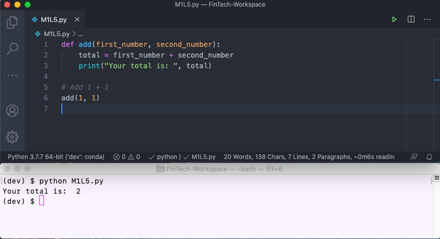
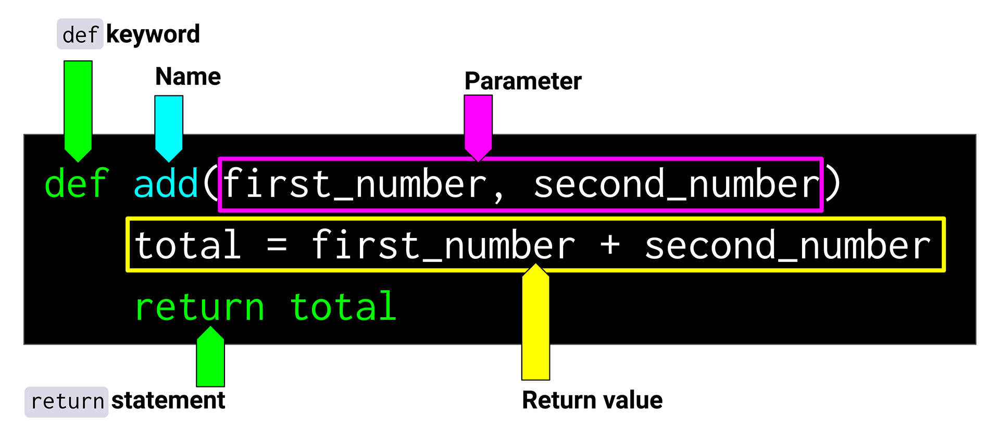
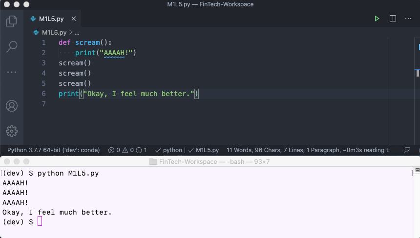
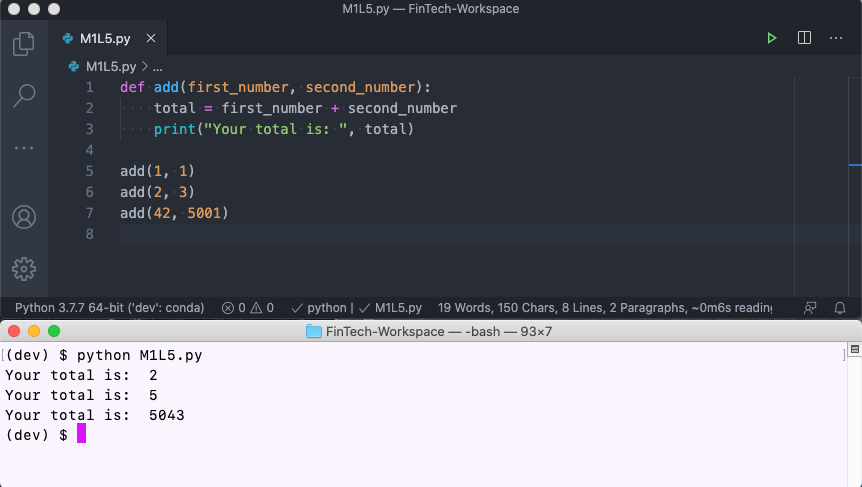
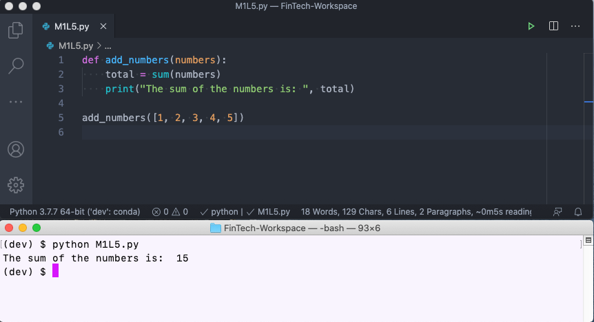
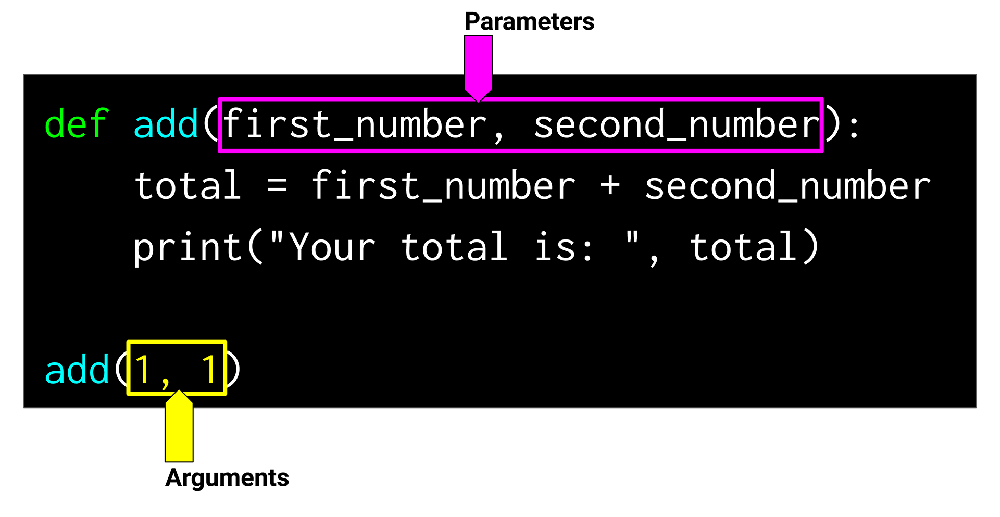

# Lesson 5: Financial Functions

## Functions and DRY Code

Experienced programmers love the mantra, “Don’t repeat yourself.” They repeat it so much that it's become an acronym: **DRY.**

So when we say that good fintech programmers love being DRY, we mean that they look for ways to simplify and reuse common code.

In this lesson, you’ll learn how to create functions in Python that can make your code cleaner as well as easier to read and use.

> **Challenge Connection** In this week's Challenge, you'll create reusable financial functions. This skill will change your life as a programmer!

## Python Functions

You may have already encountered functions in your daily work. Have you ever used `sum()` in a spreadsheet tool to total a list of numbers? Or think back to when we used `max()` on a list of numbers. Surprise! This tool is actually something called a function in Python.

**Functions** are programming constructs that let you group blocks of code and then reuse that code throughout your program. The following code shows an example of a Python function:

```python
def add(first_number, second_number):
    total = first_number + second_number
    print("Your total is: ", total)
```

Let's break down this example:

* The first line tells Python that we're dealing with a function. `def` stands for "define," which indicates that we're defining a function.

* The two indented lines that follow contain the actual code of the function. This function adds two numbers and then prints the result.

Now we can use this function however we want, like in the following example:

```python
# Add 1 + 1
add(1, 1)
```

The output for this function is as follows:



This example follows the concept of DRY. By putting these two lines of code into a function, we save ourselves the trouble of copying and pasting those lines any time the two numbers that are  being summed change. Instead, we just write the function name (`add()`) followed by the two numbers we want to sum.

> **Skill Drill** Try coding this function, but add different numbers each time. You can use it over and over, as much as you want!

Okay, so functions are great, right? They can really DRY up a program, and that's a good thing! Now let's dig into how functions work.

## Defining Functions

Defining a function is a straightforward process. As shown in the following image, all we need is the `def` keyword, a function name, and a few things at the end (don't worry, we'll explain all of this):



> **Rewind** Remember that keywords are special, reserved words in the Python language. Just like `if` and `else` for truth tests, `def` is a special, reserved keyword in Python used to define a function.

Let's start by discussing the function name.

### Function Definition

Similar to variables, function names are descriptive and indicate the task being executed by the function. The name of the function should be followed by a set of parentheses and a colon, `:`. This line of code, shown in the following example, is the **function definition**:

```python
def descriptive_function_name():
```

### Function Body

After defining the function, you can then put any code that you want in the **function body**. The secret, though, is that the code in the function body must be indented. Otherwise, the code is just part of the normal program. The following example shows what this looks like:

```python
def scream():
    print("AAAAH!")
scream()
scream()
scream()
print("Okay, I feel much better.")
```

The result of the screaming appears below:



> **Skill Drill** Try coding the preceding example, but add some extra print statements. Pay close attention to what happens if you indent or unindent some of the print statements.

In this example, only the print statement that’s indented belongs to the function. Anything else is just considered part of the normal program, but it won't be included when you use the function.

Let's look at another example, as follows:

```python
def print_coffee_cup():
    print("c[_]")
```

What happens when you run this code?

This was a trick question! Nothing happens when you run the code. We need to discuss another important part of functions—the function call.

## Calling Functions

In the previous examples, we were actually both defining the function and calling it. Can you guess which line is the function call in the following example?

```python
1 def scream():
2     print("AAAAH!")
3 scream()
```

Let's break down this code snippet:

* Line 1 is the function definition.

* Line 2 is the function body.

* Line 3 is the function call.

You can think of lines 1 and 2 like a blueprint of a house. They tell Python that there's a block of code with a function name, but it doesn't run the code until you need it.

Line 3 is where the magic happens. This is what tells Python to actually run, or execute, the code inside the function.

> **Important** A function must be called to be used. Without a function call, a function won’t execute its task.

As we saw earlier, you can call a function as many times as you want! Count the calls in the following example:

```python
scream()
scream()
scream()
```

Now that we've sorted this out, let's practice.

## Activity: A Definitive Buy

In this activity, you're building the back end of a new payment processing system. Each time a payment occurs through your system, a $0.75 fee is charged to the merchant who uses it. As this will be run on millions of transactions, your task is to write a single, reusable function for this process.

### Files

Download the files for this activity to help you get started:

[A Definitive Buy Files](Activities/01_A_Definitive_Buy.zip)

### Instructions

Open `a_definitive_buy.py` in the Unsolved folder, and then complete the following steps:

1. Define a new function and name it `process_payment`.

2. In the first line of the function, print the total transaction fee charged. For example, "The total cost of this transaction will be 75 cents."

3. In the second line of the function, print a notification that the charge was processed successfully. For example, "Ka-ching! Payment has been processed."

4. Call the function. Does it do what you expected it to do?

### Solution

How did you do? Check your solution with the following assessment:

<p><iframe style="width: 100%; height: 800px;" src="/courses/244/external_tools/retrieve?display=borderless&amp;url=https%3A%2F%2Flearnosityplayer.atomicjoltapps.com%2Flti_launches%2FuBUnb8r9gRRrwouz98E2qXs2" width="100%" height="800px" allowfullscreen="allowfullscreen" webkitallowfullscreen="webkitallowfullscreen" mozallowfullscreen="mozallowfullscreen" allow="autoplay *"></iframe></p>

If you want to review the solution step by step, use the following video walkthrough:

<p><iframe src="https://fast.wistia.net/embed/iframe/ikjxh4d769?seo=false" title="1.5 Activity 1: Soln a Definitive Buy Video" allow="autoplay; fullscreen" allowtransparency="true" frameborder="0" scrolling="no" class="wistia_embed" name="wistia_embed" allowfullscreen msallowfullscreen width="640" height="360"></iframe></p>

### What's Next?

Great job with this activity! You can already see the value in creating reusable code with functions.

Did you notice anything about this activity, though? Did you feel like some of the values in the calculation were predetermined? In some situations, that may be perfectly fine, but sometimes you may need the calculations to be more dynamic.

## Making Functions Dynamic

Let's consider a function that can add two numbers, as follows:

```python
def add():
    first_number = 1
    second_number = 2
    total = first_number + second_number
    print("Your total is: ", total)

add()
```

This function isn't very useful; if we wanted to add anything other than 1 + 1, we’d need to modify the function definition.

We can improve the function by using function parameters.

### Function Parameters

**Function parameters** are variables in the function definition that can be used in the function body. Let's modify the previous example to use parameters, called `first_number` and `second_number`, as follows:

```python
def add(first_number, second_number):
    total = first_number + second_number
    print("Your total is: ", total)

add(1, 1)
add(2, 3)
add(42, 5001)
```

The result from running this code snippet appears below.



As you can see, these parameters allow us to add any values we want: 1 and 1, 2 and 3, 42 and 5001.

Pretty cool, right? Parameters allow us to create dynamic functions that can accept values. We use variable names for parameters because the function doesn't know what values those will hold until we call the function.

> **Skill Drill** Try modifying the preceding code to accept a third parameter, and add that number to the total.

#### Parameters and Data Containers

Function parameters can also be data containers like lists or dictionaries. In this example, we can calculate the sum of a list of numbers, as follows:

```python
def add_numbers(numbers):
    total = sum(numbers)
    print("The sum of the numbers is: ", total)

add_numbers([1, 2, 3, 4, 5])
```

Let's break down this code:

* The function `add_numbers` uses the `sum()` function, which is specifically for list operations.

* The list `numbers` is summed and then saved to the variable named `total`.

* Finally, the total is printed.



#### Function Parameters vs. Function Arguments

Be aware that programmers often use the terms **parameters** and **arguments** interchangeably, even though they're slightly different.

When we call a function, arguments are passed to the parameters. In the following image, the function is built around two parameters, but when the function is run, two arguments (the two numbers) are passed in:



## Return Values from Functions

The last thing that we'll discuss about functions is the function return.

Consider the following function:

```python
def average_numbers(numbers):
    average = sum(numbers) / len(numbers)
    print("The average is: ", average)

average_numbers([1, 2, 3])
```

This function takes in a list of numbers, sums them, and divides by their count (the length, or number of elements, of the list). It then prints the resulting average.

What if we could use the results of this calculation in other calculations? We have good news: Python lets us do this easily!

> **Important** We can return values from inside a function and use those in other parts of the code.

See the following example:

```python
def average_numbers(numbers):
    average = sum(numbers) / len(numbers)
    return average

first_average = average_numbers([1, 2, 3])
second_average = average_numbers([4, 5, 6])
print(first_average, second_average)
```

In this code, the function returns the value that’s stored in the variable `average`. This can then be assigned to other variables or even be used in larger calculations.


> **Deep Dive** You can also return more than one item from a function. There are many ways to accomplish this—to learn more, visit this [Stack Overflow thread on returning multiple values from a function](https://stackoverflow.com/questions/354883/how-do-i-return-multiple-values-from-a-function).

Nice work on functions so far! Now time to get more hands-on practice.

## Activity: Returned Goods

In this activity, you’ll create a function that automatically determines insurance payouts each week.

### Background

You've started a new fintech company with an innovative idea: an insurance offering for e-retailing firms that face risk of product returns. If a merchant experiences a return rate that's higher than their seasonal average for that product, your firm pays out a moderate amount to them.

Your task is to automate part of this process. You'll create a function that automatically determines the firm's weekly total insurance payouts.

### Files

Download the files for this activity to help you get started:

[Returned Goods Files](Activities/02_Returned_Goods.zip)

### Instructions

Open `returned_goods.py` in the Unsolved folder, and then complete the following steps.

1. Define a new function called `process_claims`. This function should accept a variable `claims`, which is a list of all new claims for that week.

2. In the first line of the function, create a variable named `total_claims`. This variable should contain the total amount of claims in the list of claims.

    > **Hint** Use the `sum()` function for lists.

3. Your insurance company isn't a nonprofit; you only pay out 30% of the losses, or claims, that any merchant submits. So, in the second line of the function, create a variable named `total_payout`. This variable should be equal to `total_claims`, multiplied by 30% (0.30).

4. Make the function return the `total_payout`.

5. Test your new function. First, copy and paste the following list of weekly claims. Then run `weekly claims` through your function. What is the total insurance payout? Use the print() statement to print the returned value from the function.

    ```python
    weekly_claims = [5000, 1000, 8000, 10000, 3000, 3500]
    ```

### Solution

How did you do? Check your solution with the following assessment:

<p><iframe style="width: 100%; height: 800px;" src="/courses/244/external_tools/retrieve?display=borderless&amp;url=https%3A%2F%2Flearnosityplayer.atomicjoltapps.com%2Flti_launches%2F4chK8wpAXrGgD3ifotPuVprg" width="100%" height="800px" allowfullscreen="allowfullscreen" webkitallowfullscreen="webkitallowfullscreen" mozallowfullscreen="mozallowfullscreen" allow="autoplay *"></iframe></p>

If you want to review the solution step by step, use the following video walkthrough:

<p><iframe src="https://fast.wistia.net/embed/iframe/kogdaklzag?seo=false" title="1.5 Activity 2: Soln Returned Goods Video" allow="autoplay; fullscreen" allowtransparency="true" frameborder="0" scrolling="no" class="wistia_embed" name="wistia_embed" allowfullscreen msallowfullscreen width="640" height="360"></iframe></p>

### What's Next?

Now that we've practiced creating DRY code with functions, let's revisit the financial calculations from the previous lesson. What if we could write financial functions that calculate present value and future value dynamically, any time that we want?

In the next and final activity of the lesson, we’ll do just that by creating a financial function to quickly evaluate different real-estate investments.

## Activity: Split-Second Homebuying, Part 2

Remember that home-buying code you wrote a while back? You just pitched it to a big real-estate investment trust (REIT). They liked it so much that they decided to license the technology.

Every day, the REIT looks at thousands of different homes to potentially buy. Their junior analysts are on the verge of revolt with all this manual sifting! Can you put that code you built into a function and have it automatically output an investment recommendation?

### Files

Download the files for this activity to help you get started:

[Split-Second Homebuying, Part 2 Files](Activities/03_Split_Second_Homebuying_Part_2.zip)

### Instructions

Your task has two main parts: creating the function and then testing it.

#### Create the Function

Open `split_second_part_2.py` in the Unsolved folder. The solutions to Part 1 of this activity are provided in this file. Follow these steps:

1. Define a new function named `price_this_home`. The function should take in the following function parameters:

    * `home_price`

    * `expected_sale_price`

    * `hurdle_rate`

    * `holding_months`

2. In the function, insert the starter code, which contains the solutions from Part 1 of this activity.

3. Have the function calculate and return the expected profit, or `net_present_value`, of the home being evaluated. This is defined as the `present_value` of the home, minus the `current home_price`.

4. Save this as a variable named `net_present_value` and return the variable at the end of the function.

#### Test the Function

Now it's time to get buy-in from your colleagues. Test your function to demonstrate its efficiency and flexibility to your team.

1. Run the function with the following parameters:

    ```python
    home_price = 100000

    expected_sale_price =  120000

    hurdle_rate =  0.10

    holding_months = 12
    ```

    Does the function work as expected?

2. To highlight the flexibility of the function, lengthen the investment holding period (`holding_months`) from 12 to 36 months. If the REIT waits this long to sell after buying, will it still make enough money?

### Solution

How did you do? Check your solution with the following assessment:

<p><iframe style="width: 100%; height: 800px;" src="/courses/244/external_tools/retrieve?display=borderless&amp;url=https%3A%2F%2Flearnosityplayer.atomicjoltapps.com%2Flti_launches%2FuKxgqRa9RFwnwXyJcfCGTmJv" width="100%" height="800px" allowfullscreen="allowfullscreen" webkitallowfullscreen="webkitallowfullscreen" mozallowfullscreen="mozallowfullscreen" allow="autoplay *"></iframe></p>

If you want to review the solution step by step, use the following video walkthrough:

<p><iframe src="https://fast.wistia.net/embed/iframe/py2ci7oxfw?seo=false" title="1.5 Activity 3: Soln Split Second Home Buying Part 2 Video" allow="autoplay; fullscreen" allowtransparency="true" frameborder="0" scrolling="no" class="wistia_embed" name="wistia_embed" allowfullscreen msallowfullscreen width="640" height="360"></iframe></p>

### What's Next?

You just did a ton of work with functions, which are a big deal in Python (and other programming languages).

Functions are a perfect example of the DRY mantra. Any time you use a piece of code repeatedly, think about whether simply wrapping it in a function would make more sense.

In this activity, you created a function that automatically determined whether a home was a good value. But, like the unfortunate REIT analysts, what if you had to apply this function to thousands, or even millions, of homes? The next lesson covers how to automate this kind of process using another all-important programming building block: the loop.
