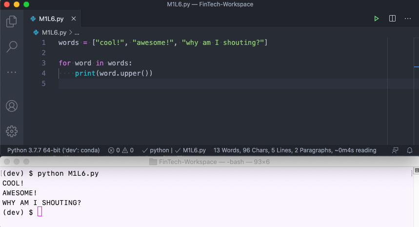
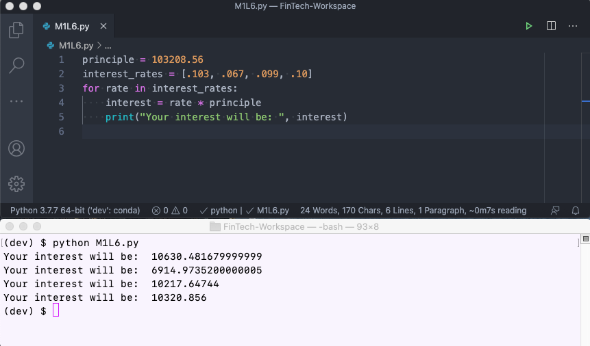
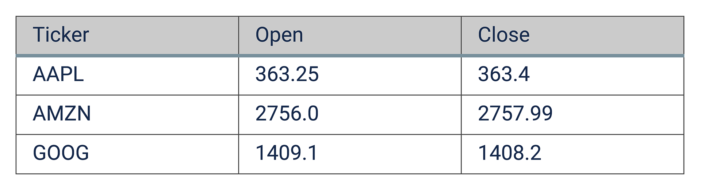
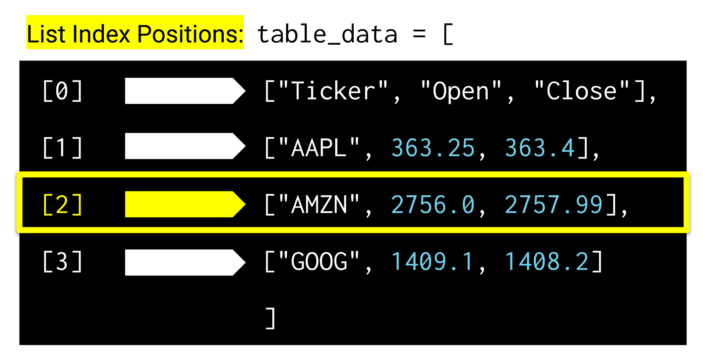
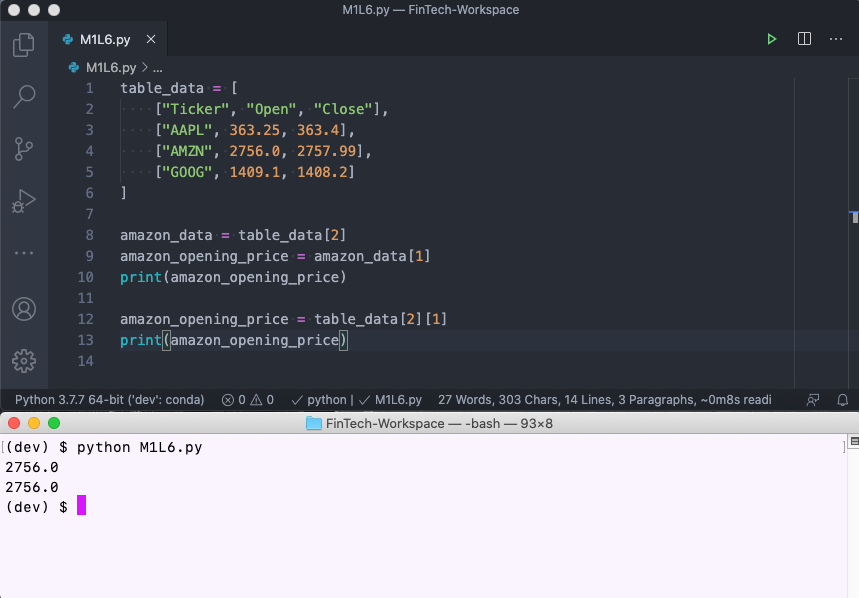
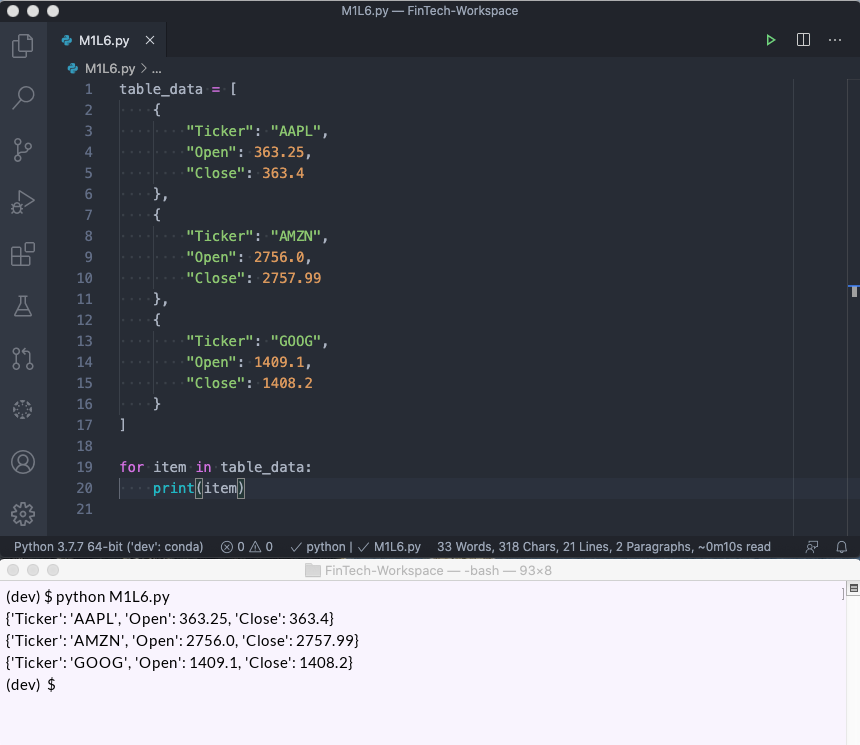
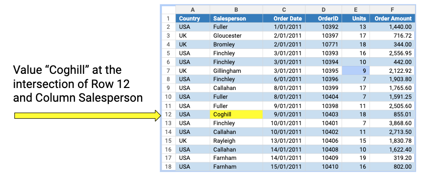
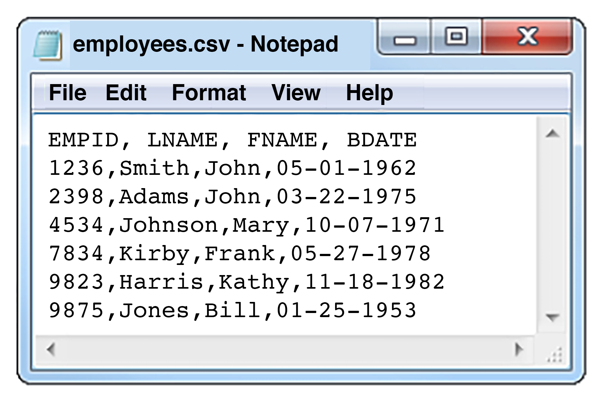
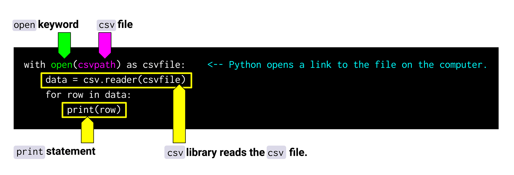

# Lesson 6: Financial Automation

## Automation with Python

Think of the largest spreadsheet you've ever worked with. Did it comprise hundreds or even thousands of rows and columns? What would you do if you needed to process data from thousands of spreadsheets that each contained thousands of rows and columns?

If you guessed that the answer has something to do with Python, you're right. You’ve already seen how Python can automate data storage, calculations, and decision-making. Now you'll see how it streamlines repeated tasks.

For example, on the job, it's time-consuming—if not impossible—to manually call a function thousands of times. As a solution, Python provides something called an iterator, which is a programming construct that handles repetition for us.

> **Challenge Connection** In the Challenge this week, you'll process loan data and save your work as a CSV file. As you might imagine, loan data can be immense, so you’ll need to use iterators to accomplish this task.

In this lesson, you’ll learn how to use Python iterators like `for` loops. You'll also learn how to open a CSV file and iterate through rows and columns of data.

## Python Iterators

Let’s begin with an example of Python iterators. In the following code, an iterator, or **`for` loop**, converts a list of lowercase text strings to uppercase:

```python
words = ["cool!", "awesome!", "why am I shouting?"]

for word in words:
    print(word.upper())
```

As a result of the for loop, the `words` list prints as follows:



> **Skill Drill** Run this code, but use the `title()` method instead of `upper()`. What happens?

Now let's break down the code.

### Iterable Objects

First, Python treats certain things as **iterable**. This means that an object, like a list, can return each item in the list one at a time.

In the following example, the list of words is iterable:

```python
words = ["cool!", "awesome!", "why am I shouting?"]
```

### Iterators

Second, the `for` keyword in Python is an iterator. An **iterator** is something that can grab each item from an iterable object (like a list), one item at a time.

> **Deep Dive** To learn more, read the [Python wiki on iterators](https://wiki.python.org/moin/Iterator).

So in the following code block, the `for` keyword acts as an iterator:

```
for word in words:
    print(word.upper())
```

In other words, iterators, or `for` loops, ask for items from an iterable object (like a list) and run code for each item.

> **Important** In the example code, the `for` keyword asks for each word in the list, one at a time. It then prints that word before it asks for the next word in the list.

### for Loops

Remember how lists are useful because we don't have to create a variable name for each item in the list? When we work with loops, we're grabbing single items from the list to use with code, which means that a variable name would actually be really handy. The `for` loop allows us to do just that.

In the example code, `word` is a variable name for the current item that was grabbed from the list. However, we can make this anything we want. See the following example:

```python
for some_item in words:
    print(some_item.upper())
```

> **Important** The variable name in a loop is reusable. Each time the `for` loop grabs a new item from the list, it assigns that item to the variable. We can then refer to the item value by using the variable name. This makes working with items in loops more straightforward.

Notice that the code inside the `for` loop is indented. Like in a function, any indented code belongs to the `for` loop. In other words, the indented code is the code that runs each time a new item is selected from the list.

Let’s suppose that each time we ask for a new word, we want to do several things instead of just one thing. For example, maybe we want to print the original word, then print the uppercase version of the word, and finally print a title case version of that word.

We can do this by including each of those print statements inside the `for` loop. Each of the indented lines of code (in this case, the print statements) will be executed for each new word from the list.

The following code shows what this looks like in action:

```python
for word in words:
    print("Original Word: ", word)
    print("Uppercase Word: ", word.upper())
    print("Titlecase Word: ", word.title())
print("I'm outside of the loop, so I only print once after all the words have been selected!")
```

This code results in the following output:


> **Skill Drill** Run this code. What happens if you unindent the third print statement? Notice that we're not changing the values of the items in the list with this code. The original list items remain unedited.

## Using Iterators for Financial Automation

Now let's apply these concepts to a financial context.

The following code is a bit more complex, grabbing a number from a list and using it in a calculation:

```python
principle = 103208.56
interest_rates = [.103, .067, .099, .10]
for rate in interest_rates:
    interest = rate * principle
    print("Your interest will be: ", interest)
```

The following output is generated when the code is run:



> **Skill Drill** Update this code so that it also tracks a running total of the interest. Create a variable outside the loop and set it to 0.0. Then update it inside the loop. What does your code look like?
>
> Solution:
>
> ```python
> principle = 103208.56
> interest_rates = [.103, .067, .099, .10]
> total_interest = 0.0
> for rate in interest_rates:
>     interest = rate * principle
>     total_interest = total_interest + interest
>     print("Your interest will be: ", interest)
> print("The total interest is: ", total_interest)
> ```

Great work! You’ve learned the basics of iterables, iterators, and `for` loops. Now put your skills to the test in a real financial problem.

## Activity: Racking Up the Profit

Your equity portfolio—that is, your collection of different stock investments—is doing well. Each of your stocks will pay a dividend (a cash payment to your investment account) at the end of the year. You need to calculate the percentage of your original investment that this payment represents (i.e., the dividend yield).

### Files

Download the files for this activity to help you get started. The provided starter code in the Unsolved folder contains a list of equity dividend yields and a variable named `stock_price`.

[Racking Up the Profit Files](Activities/01_Racking_Up_The_Profit.zip)

### Instructions

Open `racking_up_the_profit.py` in the Unsolved folder, and then complete the following steps.

1. Below the list of `dividend_yields`, create a variable named `total_dividend_income` and set it equal to zero. This variable will hold the running tally of dividends across all stocks.

2. Create a new loop. Loop through the list of dividend yields and calculate the dividend income.

> **Hint** To calculate dividend income, multiply the dividend yield by the stock price.

3. Within the loop, add the calculated `dividend_income` to the `total_dividend_income` variable.

4. Outside the loop, at the end of the code, print `total_dividend_income`. How much income will your portfolio produce?

### Solution

How did you do?

To review the solution step by step, watch the following video walkthrough:

<p><iframe src="https://fast.wistia.net/embed/iframe/c1tgelivmh?seo=false" title="1.6 Activity 1: Soln Racking Up Profits Walkthrough Video" allow="autoplay; fullscreen" allowtransparency="true" frameborder="0" scrolling="no" class="wistia_embed" name="wistia_embed" allowfullscreen msallowfullscreen width="640" height="360"></iframe></p>

### What's Next?

Nice work! Now it's time to apply what you know about iterators and iterables to some real data.

## Iterating Nested Data Structures

In finance and programming, real data is often messy and complex; in most cases, you won't work with simple lists.

Imagine working with a spreadsheet or a table of data in which rows and columns are related. To organize and work with this data, we can use sophisticated techniques like nesting data containers.

Previously, we saw how nesting aids complex decision logic. Now we'll see how it can help us store and access complex data.

### Using Nested Containers

A simple list or dictionary won’t suffice when data is complex. Consider, for example, the data in the following image—it has both rows and columns:



However, we can represent this table by using nested containers. For example, we can assume that the outer list is a list of rows and the inner lists are the cells in the column. Thus, we can represent the table as a list of lists, as follows:

```python
table_data = [
    ["Ticker", "Open", "Close"],
    ["AAPL", 363.25, 363.4],
    ["AMZN", 2756.0, 2757.99],
    ["GOOG", 1409.1, 1408.2]
]
```

We can also represent the data as a list of dictionaries, like in the following example:

```python
table_data = [
    {
        "Ticker": "AAPL",
        "Open": 363.25,
        "Close": 363.4
    },
    {
        "Ticker": "AMZN",
        "Open": 2756.0,
        "Close": 2757.99
    },
    {
        "Ticker": "GOOG",
        "Open": 1409.1,
        "Close": 1408.2
    }
]
```

Okay, we've created a couple of options for representing the two-dimensional data. Next, we'll look at how to access elements within each structure.

### List of Lists

The following code shows the list of lists:

```python
table_data = [
    ["Ticker", "Open", "Close"],
    ["AAPL", 363.25, 363.4],
    ["AMZN", 2756.0, 2757.99],
    ["GOOG", 1409.1, 1408.2]
]
```

Let's say that we want to select all of the information for `"AMZN"`. We know that this inner list is located at index position 2 of the outer list.

> **Rewind** Remember that Python lists use zero-based indexing. The first item in the list is at index position 0, so the third item in the list—in this case, `"AMZN"`—is at index position 2, as shown in the following image:
>
> 

We can use normal list indexing to retrieve and print that data, as follows:

```python
amazon_data = table_data[2]
print(amazon_data)
```

The following appears when the code is run.

![The "table_data" list of lists is shown. The variable "amazon_data" is defined and then printed. The terminal shows the following output: ['AMZN', 2756.0, 2727.99]](Images/lol.png)

> **Skill Drill** Modify this code to select the data for `"GOOG"`. What’s the result?

This seems straightforward enough, right? Well, what if we just need the opening price for Amazon? To get that, let's look at the inner list again, shown in the following code block:

```python
["AMZN", 2756.0, 2757.99]
```

The opening price is at index position 1, so we can simply retrieve the opening price from the inner list, as follows:

```python
amazon_data = table_data[2]
amazon_opening_price = amazon_data[1]
print(amazon_opening_price)
```

Python allows us to take this further and combine these two steps so that we get the value in a single line, like the following example:

```python
amazon_opening_price = table_data[2][1]
print(amazon_opening_price)
```

The following output results from running these code snippets.



> **Skill Drill** Modify this code to grab the closing price for `"AAPL"`.

Nice! Now that we can index the data we need, we can combine iterators if we need to access values from every list. Let's see what this looks like in action.

Assume that we need to print all of the tickers in the table. We can use a `for` loop to select each inner list and then access the ticker value from the selected list.

Let's call the selected list a `row`. The code to print the ticker would resemble the following example:

```python
for row in table_data:
    ticker = row[0]
    print(ticker)
```

The result is seen in the following image:


> **Skill Drill** Modify this code so that it prints the ticker and the closing price together.

You'll encounter lists of lists all the time with financial data. However, you may also see column values represented as dictionaries.

### List of Dictionaries

Let's look at this same example as a list of dictionaries, as follows:

```python
table_data = [
    {
        "Ticker": "AAPL",
        "Open": 363.25,
        "Close": 363.4
    },
    {
        "Ticker": "AMZN",
        "Open": 2756.0,
        "Close": 2757.99
    },
    {
        "Ticker": "GOOG",
        "Open": 1409.1,
        "Close": 1408.2
    }
]
```

Similar to the list of lists, we can use a `for` loop to access each inner dictionary, like the following example shows:

```python
for item in table_data:
    print(item)
```

The result from running this code appears in the following image:



Here, the item is the current dictionary selected from the list. Then we can access elements inside the dictionary using the key, `Ticker` . Let's print a list of tickers again, shown in the following example:

```python
for item in table_data:
    ticker = item["Ticker"]
    print(ticker)
```

At this point we have a list of table data where each item is a dictionary inside the list. Once we obtain a dictionary from the list, we can use the key to select values from the dictionary.

In this example, we use the key, `Ticker`, to select the stock ticker from the dictionary. Then we print the ticker. This code repeats for each dictionary in the list.


> **Pro Tip** As an alternative, many programmers prefer to use the `get()` method included with dictionaries. The `get()` works just like the key syntax, but it allows you to return a default value if the key doesn't actually exist. The following example shows how you can use `get()`:
>
> ```python
> ticker = item.get("Ticker")
> ```
>
> To learn more, visit this [Python Anti-Patterns guide to the `get()` method](https://docs.quantifiedcode.com/python-anti-patterns/correctness/not_using_get_to_return_a_default_value_from_a_dictionary.html).

Great job iterating through complex data containers! Now you can automate calculations, data storage, and decisions; you can reuse code with functions; and you can iterate through a lot of data.

There's just one problem: most financial data exists outside of Python as a separate file or spreadsheet. We need a way to bring that spreadsheet data into the Python program.

## Iterating CSV Files

Because most financial data exists outside of Python—usually in spreadsheets or other files—we need a way to read and write data to those files.

**Reading** data from a file means that you want to take the data from a file and use it in Python. **Writing** data to a file is just the opposite: it means that you have data in Python and you're saving it to a file.

First, let's discuss CSV, a common format for spreadsheet data.

### CSV Files

**CSV**, or **comma-separated values**, is a simple file format used to store spreadsheet data. Spreadsheet data is often called **tabular data** or **table data**—data organized in a table format with rows and columns.

> **Deep Dive** Table data might, for example, take the form of a spreadsheet where columns are headers, rows are records, and values are located at the intersection of each row and column.
>
> In the following image, the column header is labeled “Salesperson” (column B); the example row is 12; and the corresponding value is “Coghill”:
>
> 

A CSV file follows a tabular format: the first line is usually a **header** containing the column names, and each subsequent line is a **row** containing the values that intersect with each row-column pair. The following image shows an example of a simple CSV file:



CSV files use **delimiters** like commas to separate the rows and columns in a table. Notice how each value in this CSV file is separated by a comma? Hence the name **comma-separated value**!

To work with spreadsheet data in a CSV file, we need to bring in another tool. Specifically, we'll import and use a Python library that helps us work with CSV files.

## Python Imports

Before we can import the CSV library, we need to talk about imports in Python. Imports enable us to include a special library of tools in the code.

Think of Python like a toolbox. It has tools for almost anything that you can imagine, but sometimes a tool (or, in this case, a library) isn't included by default. Instead, you need to import that extra tool or library when you need it.

To import libraries, we use the `import` keyword. Let's start by importing `pathlib`, a library of tools designed for working with local file paths on your computer.

> **Deep Dive** The term **path** refers to the location of a file or folder on your computer. Different operating systems, like macOS and Windows, treat paths slightly differently, so a tool like `pathlib` helps resolve these differences. Though you may not always need `pathlib`, it's highly recommended when you’re working with files or folders.
>
> To learn more, see [Python's documentation on `pathlib`](https://docs.python.org/3/library/pathlib.html).

### Import the pathlib Library

To import the `pathlib` library, use the following code:

```python
import pathlib
```

This code tells Python that you want to use the `pathlib` library in your code.

Often, we just want to use one specific function from a library. In these cases, we can use the format **from import x import y**. However, in this case, we really just want the `Path` function from the `pathlib` library. Therefore, we can type the following instead:

```python
from pathlib import Path
```

Now that `Path` from the `pathlib` library is imported, you can use it to create a path to the same folder that the code file sits in. In the following code, remember that `"."` represents the current directory:

```python
from pathlib import Path

my_directory = Path(".")
print(my_directory)
```

This code creates a path object. A **path object** contains information about the location of the file on your computer.

> **Pro Tip** You could handle this step another way—you could import the `Path` tool from the `pathlib` library and use it directly. This saves some typing if you need to create a lot of paths. The following code does the same thing as the previous code, but it uses `Path` directly:
>
> ```python
> from pathlib import Path
>
> my_directory = Path(".")
> ```
>
> Think of it this way: `import pathlib`is like carrying around an entire toolbox. It has the tool `Path` (to create the path), as well as every other tool included with `pathlib`. Importing the `Path` tool instead is like grabbing a single tool from your toolbox when you need only that one.

Let's say we have a CSV file named `data.csv` in the same location as the Python file. We can use the `Path` operator from the `pathlib` library to retrieve it. To use just one component of a library, use the syntax `from library import operator`, as shown in the following code:

```python
from pathlib import Path

csvpath = Path("data.csv")
print(csvpath)
```

This is equivalent to but more concise than this code:

```python
import pathlib
csvpath = pathlib.Path("data.csv")
print(csvpath)
```

The first version is better if you are making repeated use of `Path`, because it will shorten the code in your function calls. For this example, though, either version is fine.

The result of the prior two code snippets is as follows:


Programmers often use **relative paths** to find files or folders on their computer. The following video covers relative and absolute paths:

<p><iframe src="https://fast.wistia.net/embed/iframe/0obtfrf6xp?seo=false" title="1.6 Relative vs Absolute Paths Video" allow="autoplay; fullscreen" allowtransparency="true" frameborder="0" scrolling="no" class="wistia_embed" name="wistia_embed" allowfullscreen msallowfullscreen width="640" height="360"></iframe></p>

### Activity: Pathways to Success, Part 1

In this activity, you’ll work with CSV files directly from a Python file, using the `pathlib` library. To verify the file location, you'll print the path to the CSV file.

#### Files

Download the files for this activity to help you get started:

[Pathways to Success, Part 1 Files](Activities/02_Pathways_to_Success_Part_1.zip)

#### Instructions

Use VS Code to open the activity folder. Open `pathways_to_success.py` in the Unsolved folder, and then complete the following steps:

1. Locate the CSV file called `quarterly_data.csv` in the Resources folder. Copy this file to the same location as your Python file.

    > **Important** Your spreadsheet needs to be in the same folder as your Python file. Don't skip this step!

2. Import the `Path` tool from the `pathlib` library.

3. Create a new variable named `csvpath` that contains the path to your CSV file from Step 1.

4. Print the path using the following code:

    ```python
    print(f"The relative CSV path is {csvpath}")
    print(f"The absolute CSV path is {csvpath.absolute()}")
    ```

### Solution

How did you do? Review the solution in the following video:

<p><iframe src="https://fast.wistia.net/embed/iframe/ouuo6ywx2f?seo=false" title="1.6 Activity 2: Soln Pathways to Success Solutions Part 1 Video" allow="autoplay; fullscreen" allowtransparency="true" frameborder="0" scrolling="no" class="wistia_embed" name="wistia_embed" allowfullscreen msallowfullscreen width="640" height="360"></iframe></p>

### What's Next?

You just used the `Path` tool from the `pathlib` library to successfully locate your saved CSV, all within Python.

In the next section, you’ll build on this by reading a CSV file within Python using the `csv` library. You'll be reading, analyzing, and outputting all sorts of financial data in no time!

## Read and Write to CSV Files

Now that we know how to find the path for a CSV file, we can use this information to read and write to the CSV. First, we need to get the `csv` library.

### Import the csv Library

Before we can read and write to CSV files, we need to import the `csv` library in Python and add it to the `pathlib` code.

In the code below, notice that we're using the `import` statement again, just like we do for the `pathlib` library. Specifically, we can use the following code to import the `csv` library:

```python
import csv
from pathlib import Path
```

> **Deep Dive:** To learn more about the `csv` library, read the [Python documentation on reading and writing to CSV files](https://docs.python.org/3/library/csv.html).

Perfect! Now you can start reading CSV files.

### Read a CSV File

Look at the following example of reading a CSV file—but don't worry if you don't understand all of it yet:

```python
import csv
from pathlib import Path

csvpath = Path("quarterly_data.csv")
with open(csvpath) as csvfile:
    data = csv.reader(csvfile)
    for row in data:
        print(row)
```

The result of running this code is as follows:


Did you spot a couple of new keywords? The keywords `with` and `open` open a connection from the Python program to the file you're working with—in this case, `csvfile`.

> **Deep Dive** To learn more, see the [Python documentation on `with` and `open`](https://docs.python.org/3/tutorial/inputoutput.html#reading-and-writing-files).

Before tackling the code in full, let's pull back a step and assemble it in pieces. Consider the following code:

```python
with open(csvpath) as csvfile:
    print(csvfile)
```

When we run this code, we get something that looks like the following example:

```
<_io.TextIOWrapper name='quarterly_data.csv' mode='r' encoding='UTF-8'>
```

Pretty funky, right? The `open()` method in the code has returned a `TextIOWrapper` object, which is an interface from Python to the CSV file on the computer.

> **Note** Remember, in the example, `quarterly_data.csv` is the CSV file we're working with. That's why this filename is in the preceding code.

Now we need to get the data. To do so, we'll use the `csv` library. This library includes a tool for reading file objects, which we'll use to retrieve the data from the file. Use the following code:

```python
with open(csvpath) as csvfile:
    data = csv.reader(csvfile)
    print(data)
```

This time, we're foiled again by another Python object! We get something that resembles the following code:

```
<_csv.reader object at 0x7f88b022eb50>
```

This isn't the data we need. We have to make one last adjustment to iterate through this object.

> **Important** Like a list, the `csv.reader` tool puts the data in an iterable object. So we just need an iterator like a `for` loop to access the data inside it.

Now we'll print each item of data from the CSV file. We'll call each item a row because it's like a single row of data from the CSV file. The code should look as follows:

```
with open(csvpath) as csvfile:
    data = csv.reader(csvfile)
    for row in data:
        print(row)
```

The following animation shows the `csv` library in action:



And you can see the resulting output in the following image:

![Each row of data appears in brackets, as follows: “[‘Jan’, ‘123.456’, ‘10000’]”.](Images/csv-library-output.png)

Much better! Now you have regular Python lists, which you already know how to work with.

Let's practice reading data from a CSV file.

### Activity: Pathways to Success, Part 2

In this activity, you'll work with the CSV you used in Part 1 of this activity (which is included again in the starter files below). This time, rather than just declare the path of the CSV file, you'll read the content saved in that file directly into your Python file.

#### Files

Download the files for this activity to help you get started:

[Pathways to Success, Part 2 Files](Activities/03_Pathways_to_Success_Part_2.zip)

#### Instructions

Open `pathways_to_success.py` in the Unsolved folder, and then complete the following steps:

1. Open the CSV file using `with open(csvpath) as csvfile:`.

2. Use `csv.reader` to read the CSV data into a variable named `data`.

3. Print each row to view the data line by line.

#### Extension

Create a variable above the `for` loop named `counter` and set it equal to zero. Then, every time a new row is read within the `for` loop, add a value of 1 to this variable. Print the counter and then the row of data.

### Solution

How did you do?

To review the solution step by step, watch the following video walkthrough:

<p><iframe src="https://fast.wistia.net/embed/iframe/e4gdoajt2q?seo=false" title="1.6 Activity 3: Soln Pathways to Success Solutions Part 2 Video" allow="autoplay; fullscreen" allowtransparency="true" frameborder="0" scrolling="no" class="wistia_embed" name="wistia_embed" allowfullscreen msallowfullscreen width="640" height="360"></iframe></p>

### What's Next?

So far, you've declared a `Path` and used `csv` to read in data, all within Python.

This is a big deal because it's the first step for analyzing data, which you'll learn later in this course. Regardless of what we do to the data once we read it in, we need to save the results. Therefore, in the next section, you'll learn how to write CSV files directly in Python.

## Write CSV Files

Now you know how to read data from CSV files, but there may be occasions where you also need to write data to a CSV file.

Let's start with an example. Look at the following code:

```python
import csv
from pathlib import Path

data = [
    {
        "first_name": "Jericho",
        "last_name": "Smith",
        "pin": 123
    },
    {
        "first_name": "Samantha",
        "last_name": "Jones",
        "pin": 456
    }
]

csvpath = Path("my_output.csv")
with open(csvpath, 'w', newline='') as csvfile:
    csvwriter = csv.writer(csvfile)
    for row in data:
        csvwriter.writerow(row.values())
```

You might note that this code looks similar to how you would read a CSV file, but you’ll also see a few new things.

The following code block shows the first new piece:

```python
with open(csvpath, 'w', newline='') as csvfile:
```

Let’s break down each part:

* `'w'` indicates that we're writing to a file, not reading a file. This tells Python to open a file in write mode, which allows us to write data from the Python program to a file on the computer.

* `newline=''`is also required so that the `csv` library can handle any special characters that might be in the data.

    > **Deep Dive** A **newline** character signals when a line ends and when a new line should begin. The computer converts these special characters to visual white spaces and lines when it displays the text. You don't need to worry too much about newline characters; just remember to include this code when writing to CSV files.
    >
    > To learn more, see the [Python documentation on newline characters](https://docs.python.org/3/library/csv.html#id3).

After we open the CSV file in write mode, we need to create a `csvwriter` that we can use to write data to the file. We do this with the following code:

```python
csvwriter = csv.writer(csvfile)
```

Now that we have the `csvwriter`, we can use it to write data directly to the file.

`csvwriter` has a function called `writerows` that will automatically convert a Python list to a row of data in the CSV file. We can use this function with any list we want. See the following example:

```python
csvwriter.writerow([10, 20, 30])
```

Notice in the preceding code that `writerow` accepts a list of values for that row. Those values are translated to the following line in a CSV file:

```
10,20,30
```

If the data is a list of lists, we could write each list to the CSV file with the following code:

```python
for row in data:
    csvwriter.writerow(row)
```

However, if the data container is a list of dictionaries, we have to modify this slightly. With a list of dictionaries, we need to extract all of the values from the dictionary. Python allows us to do this with a special tool called `values()`. You can use this with any dictionary to obtain a list of the dictionary values, as shown in the following example:

```python
my_dictionary = {"first_number": 10, "second_number": 20, "third_number": 30}
a_list_of_dictionary_values = my_dictionary.values()
print(a_list_of_dictionary_values)
```

The preceding code will print the following data to the screen:

```
[10, 20, 30]
```

We can use the `values()` tool to write the dictionary values as rows of data in the CSV file, like the following code shows:

```python
for row in data:
    csvwriter.writerow(row.values())
```

This will create the following rows in the CSV file:

```
Jericho,Smith,123
Samantha,Jones,456
```

One last thing! Sometimes it's useful to write a header (the column names) as the first row of a CSV file. Spreadsheets and other tools can use the header when reading the CSV file.

We can create a header by writing a list of text names for it. The following example shows how to write a header and then write the data to a CSV file:

```python
import csv
from pathlib import Path

data = [
    {
        "first_name": "Jericho",
        "last_name": "Smith",
        "pin": 123
    },
    {
        "first_name": "Samantha",
        "last_name": "Jones",
        "pin": 456
    }
]

header = ["first_name", "last_name", "pin"]

csvpath = Path("my_output.csv")
with open(csvpath, 'w', newline='') as csvfile:
    csvwriter = csv.writer(csvfile)

    # Write our header row first!
    csvwriter.writerow(header)

    # Then we can write the data rows
    for row in data:
        csvwriter.writerow(row.values())
```

That's it! Now we can practice reading and writing CSV files for a financial problem.

## Activity: Automated Equity Rounds

In this activity, you'll create a Python program that reads in data and filters it, and then you’ll save a copy that developers and spreadsheet gurus alike can open and use.

### Background

You're checking out Crunchbase because you're job hunting, and you want to know which companies have recently secured big equity funding rounds. After all, you've heard that recent big equity raisers are the ones most likely to have the best catered lunches!

These equity funding rounds, or series, are often referred to by letter—for example, a first-round raise is known as Series A. Using some data on recent equity funding rounds from Crunchbase, your task is to analyze funding rounds and filter to only the largest rounds.

### Files

Download the files for this activity to help you get started:

[Automated Equity Rounds Files](Activities/04_Automating_Equity_Rounds.zip)

### Instructions

Open `automated_equity_rounds.py` in the Unsolved folder, and then complete the following steps:

1. Review the starter code in the Python file. Notice the code has imported `csv` and `Path`. It also contains a dictionary of data on recent funding rounds.

2. Create an empty list named `big_raisers`.

3. Use a `for` loop to iterate through the list of dictionaries.

4. Inside the `for` loop, write an `if` statement that appends the dictionary to the `big_raisers` list if the funding amount is greater than $50 million.

5. Use the `csv` library and `csv.writer` to write the list of `big_raisers` to a CSV file. Use a descriptive name for your CSV file, like `large_equity_rounds.csv` or `big_raisers.csv`.

### Solution

How did you do?

To review the solution step by step, use the following video walkthrough:

<p><iframe src="https://fast.wistia.net/embed/iframe/to50xmzunm?seo=false" title="1.6 Activity 4: Soln Automated Equity Rounds Walkthough Video" allow="autoplay; fullscreen" allowtransparency="true" frameborder="0" scrolling="no" class="wistia_embed" name="wistia_embed" allowfullscreen msallowfullscreen width="640" height="360"></iframe></p>

### What's Next?

Give yourself a pat on the back. You’ve just learned how to import libraries, locate files using `Path`, and read and save CSV files using `csv`.

Knowing how to import different libraries in Python will prove handy because you might find that a lot of code has already been written for you. Using libraries means that you don't need to reinvent the wheel.

Also, data is everywhere in fintech. By reading in and saving data directly within Python, you’re unlocking your capabilities as a fintech developer.

In the next lesson, you’ll expand on these capabilities by learning how to post and share code with collaborators and potential employers using GitHub.
