# Lesson 7: Version Control, Git, and GitHub

## Welcome to Version Control

When you were writing code in the previous lessons, did you ever wish that you had saved an earlier version of your code? If you did, then you're like most developers. Sooner or later, everyone needs to access earlier versions of a codebase.

Whether you're collaborating with team members or flying solo with your own project, keeping track of code history can be challenging. Especially when you’re working with a large team, you might encounter the following issues:

* Team members might need to work on a project at the same time.

* Team members often work in different locations.

* Team members might change over the lifetime of a project.

The result? A single project with many versions. Your files might look something like the following image:

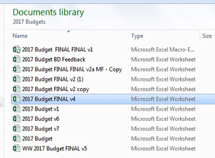

Yikes!

In this lesson, you'll learn how to use **versioning**, or **version control**, which is a way to keep track of changes to files and folders over time. To easily track versions of a program, we use Git and GitHub, a platform that uses the Git software.

> **Challenge Connection** For the Challenge this week (and for upcoming Challenge assignments), you'll use the GitHub website and version control to manage your project's codebase.

### What Are Git and GitHub?

**Git** is the version-control system that allows developers to track changes to files and folders. Git is software.

**GitHub** is a user interface that uses the Git software. It's a central location to create projects, track changes to those projects, and host files and folders.

> **On the Job** You’ll find that many vendors actually use Git on the back end. Besides GitHub, some of those other companies include GitLab, BitBucket, and SourceForge.

Under the hood, GitHub uses Git for file versioning. Before you can use and navigate GitHub, you should understand the lay of the land and familiarize yourself with some Git terminology. Time to explore some of the key terms that you'll see as you dive into the world of version control and Git!

## Git Terminology

As you get acquainted with Git, you'll notice a few key terms that may be new to you. In this section, you'll learn what these terms mean in the world of Git and GitHub.

### GitHub Repositories

Each GitHub project has a **repository**, often called a **repo** for short. This is a storage space for all of a project's files and folders.

When you create a repository, you can make it public (the default option) or private, which controls access to the codebase. Open-source software projects are built-in public repositories.

> **Challenge Connection** Your repository for this week's Challenge should be public so that your instructional staff can access your work and provide assistance if needed.

### Pushing, Pulling, and Branching

Developers **push** (upload) and **pull** (download) code to and from GitHub. GitHub holds the most recent version of a codebase as well as all past versions of it.

The most up-to-date version of a codebase is generally found in the **main** branch, which refers to the default version of a repository. Team members usually code software features on other branches so that the main branch remains clean and production-ready.

Think of a GitHub repository as a tree. The main branch is the trunk of the tree. When developers work on new features, they typically work in **branches**, which are offshoots of the trunk.

### Merge Conflicts

When development of a feature is complete, the code is reviewed to ensure that it doesn't conflict with the main branch. Then it's **merged** with, or incorporated into, the main. This process allows the tree to keep growing in harmony!

However, it's not uncommon to have a **merge conflict**. Finding these conflicts is one of GitHub's many powers. GitHub reconciles the code from new branches with code in the main branch to flag any code that might break the program. These flagged differences are called **diffs**. Before the code can be merged with main, any issues need to be resolved.

### Commits

GitHub uses **commits** to track changes to branches. Think of a commit like a snapshot of what the files and folders looked like at a particular moment in time. You can view any version of your changes by looking at the history of the project's commits.

Now that we've defined a few key terms, let's discuss how we’ll use GitHub in this course.

## Using GitHub in This Course

For the remainder of this lesson, you'll get acquainted with Git and GitHub via the GitHub **GUI**, or **graphical user interface**.

Eventually, we'll work with GitHub using the terminal and Git software, allowing for more advanced operations. But first, let's see what using GitHub looks like in practice.

We'll start by learning how to use the GitHub website.

## How to Use the GitHub Website

Now that you're familiar with the lay of the GitHub land, let's see it in action. The following video takes you on a tour of GitHub's main features:

<p><iframe src="https://fast.wistia.net/embed/iframe/jn19sl1koa?seo=false" title="1.7-GitHub-walkthrough_V0 Video" allow="autoplay; fullscreen" allowtransparency="true" frameborder="0" scrolling="no" class="wistia_embed" name="wistia_embed" allowfullscreen msallowfullscreen width="640" height="360"></iframe></p>

The best way to get comfortable using GitHub is—you guessed it—through practice. With that in mind, get ready to set up a repository and create a Python file in GitHub.

## Getting Started with GitHub

Let's practice some basic actions within the GitHub GUI.

> **Challenge Connection** For the Challenges in this course, you'll use GitHub for version control and to manage your project's codebase.

### Create a Repository

Start by navigating to the [GitHub website](https://github.com). Follow these steps:

1. Log in to your GitHub account.

    > **Note** You should have created a GitHub account as part of the prework for this course. Set up an account now if you haven't done so already.

2. On the main page, click the New button located toward the right side of the menu bar.

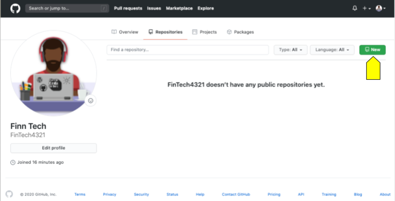

3. Give your repository a name and keep the Public option selected. Check the "Initialize this repository with a README" box, and add a `.gitignore` file for `Python`. Then click the "Create repository" button.

    > **Pro Tip** In the software world, each repository conventionally has a README file that explains what the repository contains.
    >
    > The `.gitignore` file prevents temporary, nonessential files created by your integrated development environment or programming language from being uploaded to the repository.

  You should see something like the following image:

  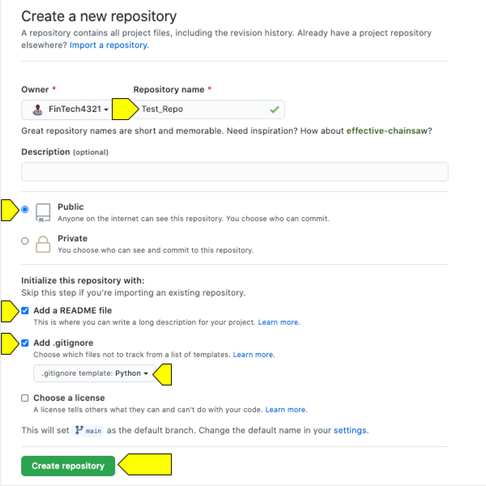

Now that your repository is created, it's time to upload some project code.

### Create and Commit a File

Follow these steps:

1. On the main repository page, click "Add file" and then select "Create new file" on the dropdown list that appears, as shown in the following image:

    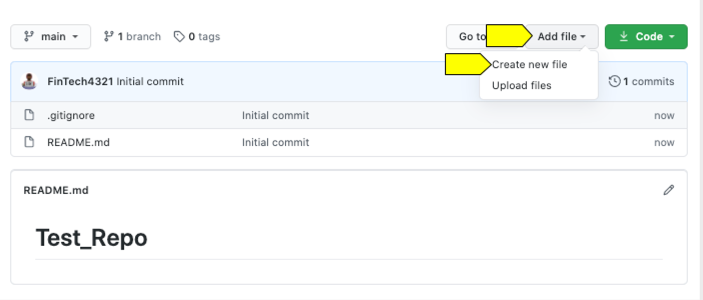

2. Create a new Python file named `main.py`. In this file, define a new function named `main()`. Inside the `main()` function, print your name. The code should look as follows:

```python
def main():
print(" <Insert Your Name Here>")
```

And the following image shows what you should see on the screen:

  

3. After writing your code, click the Preview tab. This will create a form where you provide the name of the commit—the version of the code you’ve just created—and a commit message. Create a short, descriptive name for the commit, then write a description of the changes. You might want to call the commit "Initial commit," and describe it as, "The first version of trial code I'm writing," or something similar. Notice the radio button controls beneath that main text box, which read as follows:

   * Commit directly to the main branch.

   * Create a new branch for this commit and start a pull request. Learn more about pull requests.

    Committing to the main branch is the default, so choose that option for now. Later on, when you're working within different branches, you'll need to check that you're committing to the correct branch.

4. When your commit message is complete, click "Commit new file", as shown in the following image:

  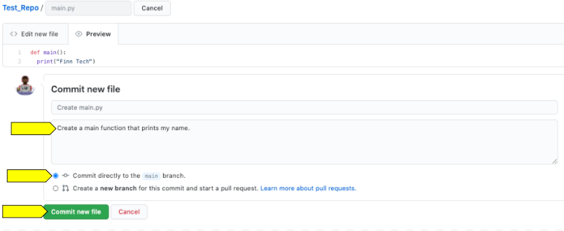

You've committed your first file to the GitHub repo!

But wait a second—we’ve forgotten to call the `main` function so that it runs when the file is executed. Let's edit the file.

### Edit a File

1. From the main repository page, open the `main.py` file by clicking the file name.

2. When the file opens, initialize the edit function by clicking the pencil in the upper right-hand corner of the window, as shown in the following image:

    

3. Add the function call to the script.

4. Create a second commit message that describes your change to the code, e.g., "Calling the main function." Then click the "Commit changes" button, as shown in the following image:

    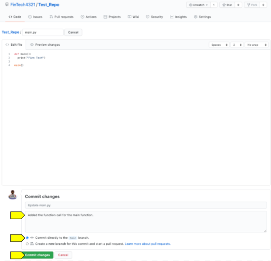

### View Commit History

Now take a moment to look at your commits. Return to the main repository page and click the “commits” link, which is located on the far right of the branch window, just beneath the green Code button.

You should see something like the following image:

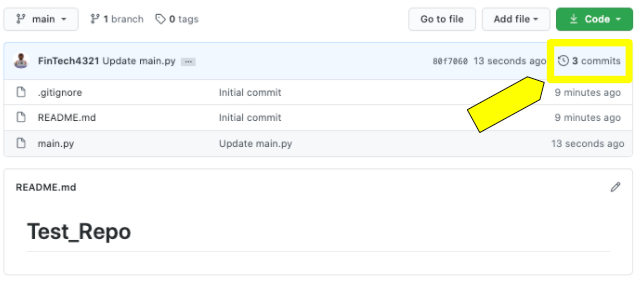

You should have three commits, as shown in the following image:

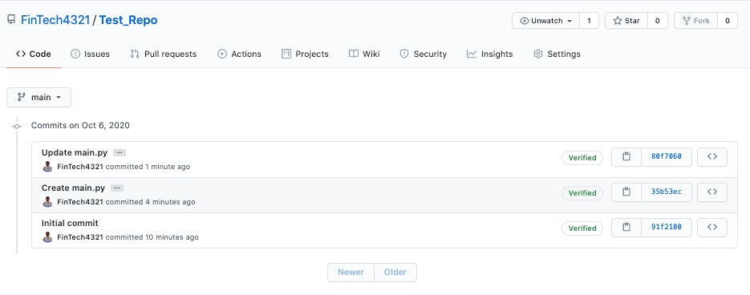

Click the latest commit. You should see your additions to the code highlighted in green, as shown in the following image:

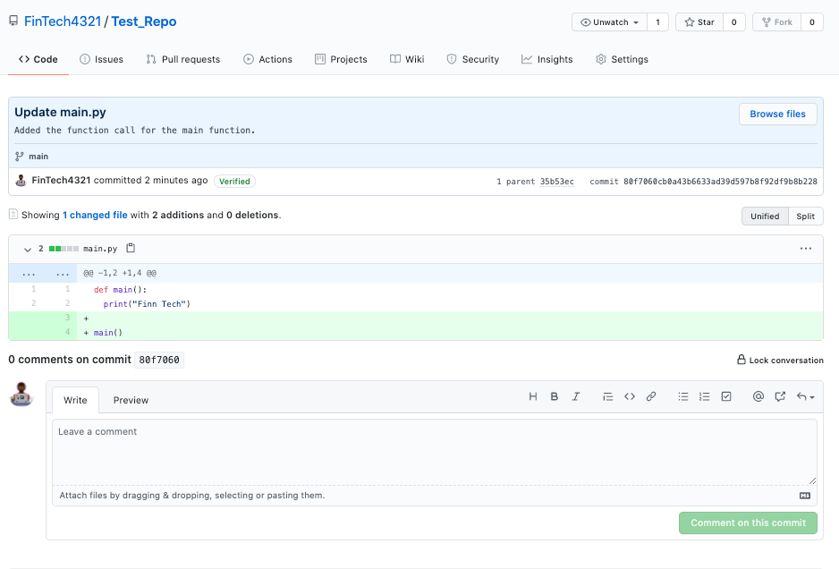

To return to the repository's main page, click the repository name, located next to your GitHub username.

Nice work navigating GitHub! As you begin working with more files and folders in GitHub for future activities and assignments, return to the instructions and video tutorial in this lesson as often as necessary.

But we won't always work with files created within the GitHub repo, as we did here. Instead, we'll typically upload folders and files from the local machine to the GitHub GUI. Next, we'll examine in more detail what this process looks like.

## Upload Local Files and Folders to GitHub

In addition to creating files directly inside a GitHub repo, we can upload files and folders from the local machine directly to the GitHub GUI.

> **Challenge Connection:** You'll follow these same steps to submit your Module 1 Challenge files to your GitHub repository!

Start by creating another new repository. You can never get enough practice in a new coding environment!

### Create a New Repo

If you're not there already, navigate to the [GitHub website](https://github.com). Then follow these steps:

1. If necessary, log in to your GitHub account.

2. On your account's main page, click the New button.

3. Give your repository a name, keep the repo public, and check the "Initialize this repository with a README" box. You also need to add a `.gitignore` file for Python. Then click the "Create repository" button.

    > **Pro Tip** You’ll repeat this process over and over again in your career. Always select "Initialize this repository with a README" and include a `.gitignore` file for Python.

  You should see something like the following image:

  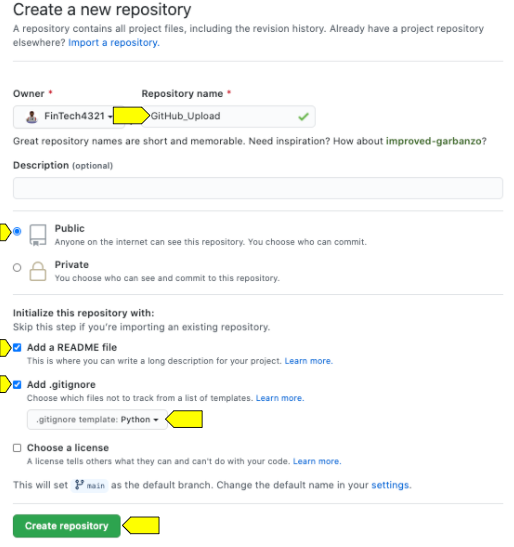

Now that you've created your new repo, open VS Code. Next we'll create a folder and file to upload.

### Create a Local Python File

With VS Code open on your machine, follow these steps:

1. On your desktop, create a folder named `GitHub_Upload`.

2. Open this folder in VS Code, and create a new file named `main.py`.

3. In this file, define a new function named `main()`. Print your name inside the `main()` function. Don't forget to call the function! Your code should look like the following example:

      ```python
      def main():
        print("Hello, My name is <your name here>.")

      main()
      ```

You should now have a folder named `GitHub_Upload` that contains your new Python file, `main.py`.

Now we'll upload it to GitHub.

### Upload the File to GitHub

Navigate back to your repo in GitHub, then follow these steps:

1. Click the "Add file" button and select "Upload files" from the dropdown list, as shown in the following image:

    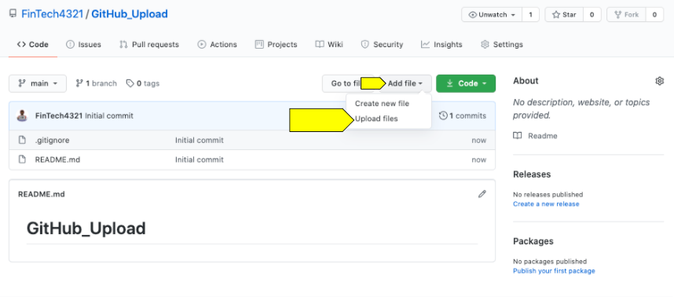

2. Drag and drop your `GitHub_Upload` folder from your desktop into the appropriate space in the file upload window. You'll notice that your file path appears below the box.

3. Add the required commit message and then click the "Commit changes" button, like in the following image:

    

4. On the main page of your repo, you should see the folder that was just uploaded, as shown in the following image:

    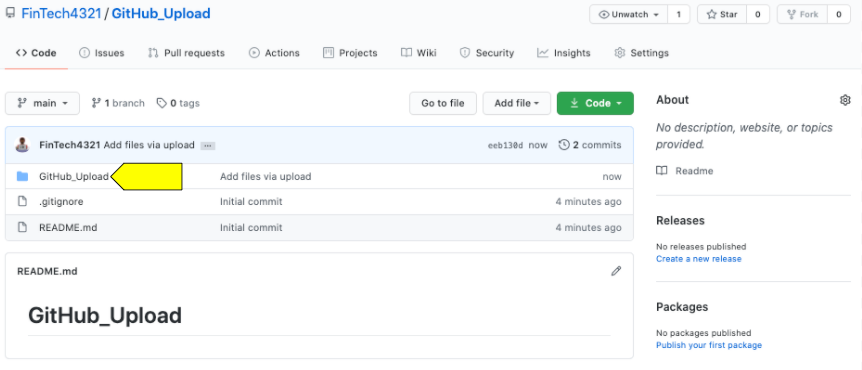

Now you can navigate the folder and edit the `main.py` file directly in GitHub.

> **Important** Any changes you make to a file directly in GitHub will NOT be automatically transferred to your local machine. To transfer information between your machine and GitHub, you'll need to push and pull. You'll learn about these functions in the next module.

Remember, you can see the commits that you made to this new repository by clicking the "commits" tab, shown in the following image:

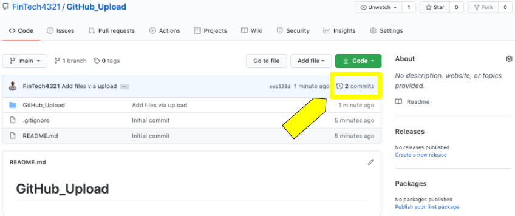

Are these GitHub processes becoming more familiar to you? You'll be a pro in no time.

You've picked up the basics in this lesson, but you’ve just begun to scratch the surface of what Git and GitHub offer. Later, you'll learn much more about the functionality and importance of these systems.

## Git Review

How are you feeling about Git so far? Use the following quiz to check your understanding of Git and GitHub in preparation for the Module 1 Challenge.

<p><iframe style="width: 100%; height: 800px;" src="/courses/244/external_tools/retrieve?display=borderless&amp;url=https%3A%2F%2Flearnosityplayer.atomicjoltapps.com%2Flti_launches%2FZch7eWJCnjS2UzBMDEon7V1E" width="100%" height="800px" allowfullscreen="allowfullscreen" webkitallowfullscreen="webkitallowfullscreen" mozallowfullscreen="mozallowfullscreen" allow="autoplay *"></iframe></p>
