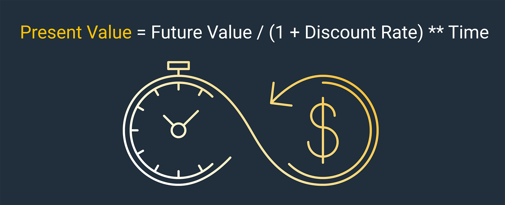
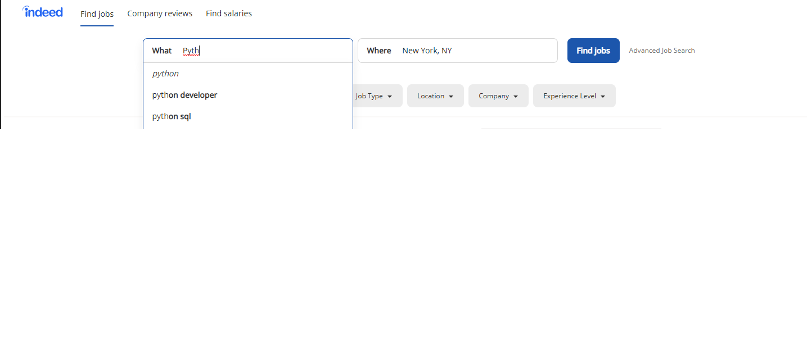

# Application

## Challenge: Python Loan Analysis


Welcome to your first Challenge! Each module ends with a graded Challenge assignment, where you'll apply your new skills to a fintech problem. Challenges are designed to be complex, and you may need several hours to complete them. You can skip up to TWO Challenges in this course. The Challenge rubric, included in the Requirements section, contains more information about how this assignment is graded.

### Background

You work for a lending startup engaged in microcredit loans. The company needs help valuing these loans. In this Challenge, you'll automate a process that does just that.

### What You're Creating

You’ll create a Python program that automates the tasks associated with valuing microlending loans. Specifically, you'll do the following:

1. Create a GitHub Repository

2. Automate the Calculations

3. Analyze Loan Data

4. Perform Financial Calculations

5. Conditionally Filter Lists of Loans

6. Save the Results

You'll then upload your final code to GitHub.

### Files

[Module 1 Challenge Files](Challenge/Starter_Code.zip)

### Instructions

#### Create a GitHub Repository

First things first: because you'll be submitting your assignment via a link to your GitHub repo, set up a [GitHub](https://github.com/) repository for this Challenge. As you work, upload all of your code and results to this repository.

When you're done, move on to Part 1 of the Challenge.

#### Part 1: Automate the Calculations

In this first part of the Challenge, you'll use loops and variables to automate the calculations for the loan portfolio summaries.

> **Important** The loan data you need for this Challenge is provided in the starter code files, as a list of prices stored as a variable named `loan_costs`, like in the following example:
>
> ```python
> loan_costs = [500, 600, 200, 1000, 450]
> ```

Begin with some calculations on a list of prices for five loans. Complete the following steps:

1. Use the `len()` function to calculate the total number of loans in the list.

2. Use the `sum()` function to calculate the total of all loans in the list.

3. Using the sum of all loans and the total number of loans, calculate the average loan price.

4. Print all calculations with descriptive messages.

Nice work! Your manager loves this automated calculation feature. She explains that the company receives over 1 million loan cost prices every day, so you’ve saved the company a considerable amount of time by automating this process.

#### Part 2: Analyze Loan Data

Next, you'll use more detailed data for one of these loans to calculate **present value**, or fair price, of what this loan would be worth.

Complete the following steps:

1. Use `get()` on the dictionary of loan data to extract the future value and remaining months on the loan. Save these variables, named `future_value` and `remaining_months`, and then print each variable.

    > **Hint** The **future value** is the amount of money the borrower must pay back upon maturity of the loan (also known as the **face value**).
    >
    > **Remaining months** is the remaining maturity (in months) before the loan needs to be fully repaid.

2. Use the formula for present value to calculate the fair value of the loan. Use a minimum required return of 20% as the discount rate. You can find the the present value formula in the following image.

    

    > **Note** In Python, the operator for exponents is **. To learn more, see the [Python documentation on the power operator](https://docs.python.org/2.0/ref/power.html).

    More specifically, you'll want to use the **monthly** version of the present value formula:
      * Present Value = Future Value / (1+ Annual_Discount_Rate/12)**Months

3. Now that you have the data you need, write a conditional statement (an `if-else` statement) to decide whether the present value represents the loan's fair value.

    * If the present value of the loan is greater than or equal to the cost, then print a message that says that the loan is worth at least the cost to buy it.

    * If the present value of the loan is less than the loan cost, then print a message that says that the loan is too expensive and not worth the price.

If present value represents the loan's fair value (given the required minimum return of 20%), does it make sense to buy the loan at its current cost?

#### Part 3: Perform Financial Calculations

Your manager is impressed that you managed to prototype the code for the present value calculation. She wants to use this calculator for every loan the company has.

To facilitate this task, you'll need to create a financial function that can be reused with new data values.

In this part of the Challenge, you’ll use the present value calculation. But you’ll place the calculation in a function so that the code can be reused in the future, if the company acquires new loans to consider.

Your function could then be used as shown in the following example:

```lang-python
annual_discount_rate = 0.20
present_value = calculate_present_value(
    new_loan["future_value"],
    new_loan["remaining_months"],
    annual_discount_rate)
```

Complete the following steps:

1. Define a new function to calculate present value. The function should meet the following criteria:

    * Include parameters for `future_value`, `remaining_months`, and the `annual_discount_rate`.

    * Return the `present_value` for the loan.

2. Use the function to calculate the present value of the new loan. Use an `annual_discount_rate` of 0.2 for this new loan calculation.


#### Part 4: Conditionally Filter Lists of Loans

Because you're doing such great work, management has asked you to apply your programming skills yet again—this time to lists of data.

Now your task is to loop through a series of loans that the company is considering and filter them to find the inexpensive ones.

> **Hint** The data provided in the starter code is a list of dictionaries. Remember that you can loop through items in a list using a `for` loop.
>
> For each item in the list, use the `get`() method for dictionaries to select the value that you’re interested in.
>
> See this [guide to Python dictionaries](https://realpython.com/python-dicts/) or the [official Python documentation](https://docs.python.org/3/tutorial/datastructures.html) to find examples.

Complete the following steps:

1. Create a new, empty list named `inexpensive_loans`.

2. Use a `for` loop to select each loan from a list of loans. Inside the `for` loop, write an `if` statement to determine whether the `loan_price` is less than 500.

3. If the `loan_price` is less than 500, append the loan to the `inexpensive_loans` list.

4. Print the list of inexpensive loans.

#### Save the Results

Great job wrangling this data with your custom filter!

Your manager has one last request before you log off for the day: to send a copy of your data as a spreadsheet or CSV for the company's business analysts.

In this final task of the Challenge, output your list of inexpensive loans to a CSV file. Use Python's `csv` library to create the `csvwriter` for this task.

> **Deep Dive** For more information, refer to the [`csv` library documentation](https://docs.python.org/3/library/csv.html#writer-objects).

Complete the following steps:

1. Use `with open` to open a new CSV file.

2. Create a `csvwriter` using the `csv` library.

3. Use the new `csvwriter` to write the header variable as the first row.

4. Use a `for` loop to iterate through each loan in `inexpensive_loans`.

5. Use the `csvwriter` to write the `loan.values()` to a row in the CSV file.

### Requirements

#### Automation: Use Python to Automate Calculation of Data (10 points)

##### To receive all points, your automation must:

 * Calculate the total number of loans in the list. _(2 points)_

 * Calculate the total value (sum) of all loans in the list. _(2 points)_

 * Using the sum of all loans and the total number of loans, calculate the average loan price. _(2 points)_

 * Print all calculations, each with a descriptive message. _(2 points)_

 * Run without error and produce the required result. _(2 points)_

#### Analysis: Analyze Loan Data (20 points)

##### To receive all points, your code must:

 * Use `get()` to extract *future value* and *remaining months* variables, named accordingly. _(5 points)_

 * Calculate fair value of the loan using the present value formula and a 20% discount rate. _(5 points)_

 * Use a conditional statement to determine and print the loan's fair value. _(5 points)_

 * Analyze the loan value with a minimum return of 20% in order to determine purchasability of the loan. _(5 points)_

#### Financial Calculations: Perform Financial Calculations (20 points)

##### To receive all points, your code must:

 * Create a new function to calculate present value, parameters included and present_value returned. _(10 points)_

 * Use a function to calculate present value of the new loan, using an annual discount rate of 0.2. _(10 points)_

#### Filter Lists of Loans (10 points)

##### To receive all points, your code must:

 * Create an empty list, `inexpensive_loans`. _(1 point)_

 * Use a `for` loop to determine if `loan_price` is less than 500. _(3 points)_

 * Append the `inexpensive_loans` list with `loan_price` that are less than 500. _(3 points)_

 * Print the `inexpensive_loans` list. _(3 points)_

#### Save Results (10 points)

##### To receive all points, your code must:

 * Use `with open` to open a new CSV file. _(2 points)_

 * Create `csvwriter` using the `csv` library. _(2 points)_

 * Use `csvwriter` to write the header variable in the first row.  _(2 points)_

 * Use a `for` loop to iterate through each loan in `inexpensive`. _(2 points)

 * Use `csvwriter` to write the `loan.values()` to a row in the CSV file. _(2 points)__

#### Coding Conventions and Formatting (10 points)

##### To receive all points, your code must:

 * Move imports to the top of the file, just after any module comments, and before module globals and constants. _(3 points)_

 * Name functions and variables with lowercase characters, with words separated by underscores. _(2 points)_

 * Follow DRY (Don't Repeat Yourself) principles, creating maintainable and reusable code. _(3 points)_

 * Use concise logic and creative engineering where possible. _(2 points)_

#### Deployment and Submission (10 points)

##### To receive all points, your files should:

 * Be contained in a repository cloned to your local machine. _(4 points)_

 * Have been added to the repo using the command line. _(3 points)_

 * Contain appropriate commit messages. _(3 points)_

#### Comments (10 points)

To receive all points, your code should be well commented with concise, relevant notes that can be understood by another developer. _(10 points)_

---

### Submission

To submit your Challenge assignment, click Submit, and then provide the URL of your GitHub repository for grading.

> **Note** You are allowed to miss up to two Challenge assignments and still earn your certificate. If you complete all Challenge assignments, your lowest two grades will be dropped. If you wish to skip this assignment, click Submit, and then indicate you are skipping by typing “I choose to skip this assignment” in the text box.

---

## Career Connection


Welcome to your first Career Connection! This lesson at the end of each module will review real-world applications for the material covered in the past week. We’ll prepare you to be tested on your new knowledge in technical interviews and suggest strategies to become employer-competitive.

We've consulted many employers to learn what will help you stand out from the crowd. Armed with that knowledge, we'll guide you through steps you can take every week to get there.

### Becoming Employer-Competitive

Here at Career Services, we refer to two levels of job preparedness: **employer-ready** and **employer-competitive**. Let's look at what these terms mean:

* **Employer-ready** means that you meet the minimum requirements to apply for a developer job. You have strong, complete job search materials (for example, a resume and/or portfolio).

* **Employer-competitive** means that you've given yourself the best chance to secure your desired job. You've put together excellent job search materials, you know how to prepare for interviews, and you use multiple networking strategies to proactively seek and pursue the jobs you want.

> **Deep Dive** To learn more, see this [Intro to Career Services](https://mycareerspot.org/intro).

Most of the students who work with Career Services to reach the employer-competitive level find employment within six months after earning their certificate!

Being employer-competitive means starting now, by positioning yourself and engaging with the fintech community. Ready to get started? Complete the following three steps, and you’ll be that much closer to acing the job interview when the time comes.

#### Step 1: See What's Out There

Peruse open-source projects to get a feel for what's out there. Pay attention to how other developers organize and document their projects. Look at their README.md files, their hosted documentation, and even their commit messages.

You can start by reviewing the following projects on GitHub:

* [QuantEcon](https://github.com/QuantEcon/QuantEcon.py)

* [Pandas](https://github.com/pandas-dev/pandas)

* [Zipline](https://github.com/quantopian/zipline)

#### Step 2: Learn How to Market Yourself

Browse professionally designed apps for inspiration as you prepare to build your personal projects. The following links provide numerous examples of concept and execution:

* [Data science projects](https://www.dataoptimal.com/data-science-projects-2018/)

* [Visualization projects](https://flowingdata.com/2017/12/28/10-best-data-visualization-projects-of-2017/)

* [Fintech projects](https://finos.github.io/?sort=hotness-down)

#### Step 3: Code a Lot—and Put It All on GitHub

Many companies will ask you to pair program with one of their developers during an interview, so practice this skill with a friend or classmate. Also, because GitHub makes it easy for employers to check your commit history, ensure that both you and your partner commit to GitHub regularly. And don’t forget to keep your commit messages clean and professional!

Review your own code commit chart periodically to see how you appear to employers. The following image shows an example of a commit chart:


In this chart, each green box represents a time when a commit was made. The darker the green, the more commits that happened around the same time. Big gray spaces look bad to prospective employers, while lots of green boxes look awesome.

### Look to the Future

This week, you learned Python, which is fundamental to learning any financial analysis and visualization technologies you'll develop in the future. You’re already on your way to becoming a fintech professional!

Financial analysts and engineers work on complex projects with a variety of technologies and tools. So as you learn to code, use plenty of tools and methodologies from current real-world projects.

But it all begins with Python. Though it's unlikely that you'll ever interview directly for a Python job, you'll almost definitely face questions about Python and programming and algorithms at some point in the interview process. Start practicing these skills now.

#### Step 1: Investigate Fintech and Finance Job Listings

[Indeed.com](https://www.indeed.com/) is a great resource for finding a variety of job postings. Visit the website and search for jobs that call for Python and Git, as shown in the following image:



Look through the search results for each category. Then write your answers to the following questions:

* **Where do Python and Git typically appear in the job description?**

    You may find the terms listed with other technologies, under a heading like Skills Required, Tech Stack, or something similar. These lists can be intimidating, but think of them as nothing more than wish lists—most companies know they won’t get everything they want. Don’t be afraid to apply for jobs where you only know 60% or 70% of the required technologies. Employers are also looking for that all-important **cultural fit**, meaning that they want someone who will work well with the team. Technical skills can be taught, but cultural fit can't be.

* **What other skills are listed alongside Python and Git?**

    Besides Python and Git, you might see job postings that call for skills like machine learning, object-oriented design, blockchain, Scikit-learn, natural language processing, SQL, JSON, or cloud computing. By the end of this course, you'll possess these skills too. You might see other technologies listed—like Azure, Django, Flask, or PyTorch—that aren't covered in this course. Yet the skills you'll learn transfer directly to these other technologies. They aren't all that different, anyway!

* **What level of experience, in years, are employers typically looking for?**

    You’ll notice that almost all job postings specify at least two to three years of development experience. Those looking for senior developers will call for five to eight years minimum. Again, treat these requests like a wish list. If you see a job posting along the lines of “Quantitative analysis, two years experience,” you can and should apply for that job.

#### Step 2: Add Technical Skills to Your Resume

Before you move on to the next module, make sure to add Python and Git to the Technical Skills list on your resume. This will help you pass those pesky automated resume scanners and will indicate to potential employers that you have the skills they need.

> **Deep Dive** To learn more, see the [Develop Your Resume milestone](https://mycareerspot.org/resume) on the Career Services website.

### Prepare for the Technical Interview

Many companies use algorithm questions during the technical interview. For Python and Git, consider the following common technical interview questions:

* What are the key features of Python?

* How is Python an interpreted language?

* What are local variables and global variables in Python?

* What are the advantages of using Git?

When you've answered these questions on your own, search the internet to check your answers.

### Career Services Events


To learn more about the technical interviewing process, attend [Career Services' upcoming workshops](https://careerservicesonlineevents.splashthat.com/).
